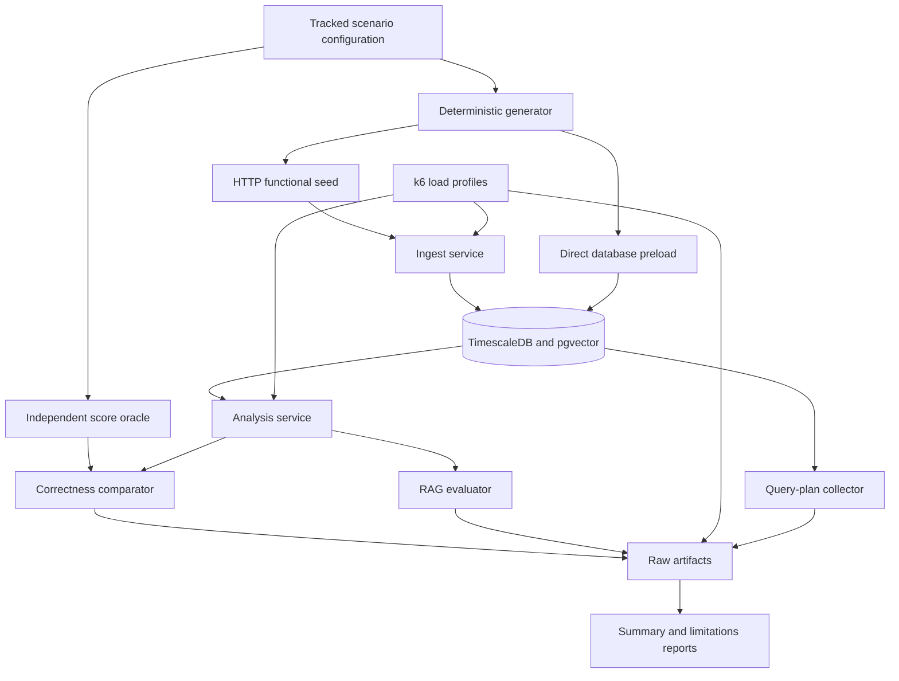

# Evaluation Plan and Reproducibility Runbook

## 1. Purpose

This document is the implementation plan and operational runbook for evaluating the Report Flow reference implementation described in `SPECIFICATIONS.md`.

The evaluation has five goals:

1. verify that the implemented score follows the specified equations;
2. verify ingestion, persistence, measurement identity, and pond-cycle integrity;
3. evaluate TimescaleDB query and deterministic score performance;
4. evaluate HTTP behavior under controlled load;
5. evaluate RAG retrieval, answer quality, abstention, and conversational latency.

This evaluation characterizes the **tested reference implementation under a recorded environment**. It does not prove that the score is biologically valid, that every deployment will have the same performance, or that every implementation of the architecture will obtain equivalent results.

No official result may be reported without its raw artifacts and environment manifest.

---

## 2. Scope

### 2.1 Included

- deterministic scoring correctness;
- irregular-interval and missing-period behavior;
- per-parameter and overall coverage;
- invalid HTTP input behavior;
- controlled HTTP ingestion integrity;
- measurement uniqueness and pond-cycle integrity;
- deterministic database preload;
- sequential TimescaleDB aggregation and score benchmarks;
- concurrent ingestion and analysis load tests with `k6`;
- query-plan inspection;
- application, database, and host resource observations;
- RAG retrieval and answer evaluation;
- machine-readable results and human-readable reports.

### 2.2 Deferred

MQTT/sensor validation is deferred until the sensor and subscriber path are available. The initial evaluation will not claim MQTT ingestion coverage or include MQTT results in the ingestion-integrity denominator.

When MQTT is implemented, it will be added as a separate functional suite. The ESP32 may demonstrate the sensor path, but it must not be used as the load generator.

### 2.3 Optional comparisons

The following are useful but are not required for the first complete evaluation:

- isolated cold-cache measurements;
- standard PostgreSQL table versus TimescaleDB hypertable;
- continuous-aggregate comparison;
- real producer data;
- parameter-specific threshold experiments;
- alternative dissolved-oxygen functions.

Optional experiments must not be mixed into the primary result distributions.

---

## 3. Validation claim boundary

The evaluation can support claims that:

- the implementation follows the configured mathematical model;
- data is validated and persisted according to the tested HTTP contract;
- time coverage and unfavorable duration are calculated consistently;
- synthetic scenarios have the expected numerical results and ordering;
- the selected queries have measured behavior at defined database sizes;
- retrieval and generated answers meet or miss a labeled rubric;
- the prototype meets or misses its initial engineering targets in the recorded environment.

The evaluation cannot, without field evidence and specialist review, establish that:

- the score accurately measures shrimp health;
- the score predicts mortality, growth, feed conversion, or production outcome;
- the configured threshold, weights, or Gaussian widths are biologically optimal;
- TimescaleDB is universally faster than PostgreSQL;
- external AI latency or behavior will remain stable over time.

---

## 4. Frozen evaluation contract

Every official run must record this contract in its manifest. Changing any item creates a new evaluation configuration and invalidates direct comparison unless the difference is explicitly controlled.

### 4.1 Parameters and identifiers

The score requires exactly four parameters:

| Concept | Runtime `parameterCode` | Unit |
|---|---|---|
| Temperature | `temperature` | `°C` |
| pH | `ph` | `pH` |
| Salinity | `salinity` | `ppt` |
| Dissolved oxygen | `dissolvedOxygen` | `mg/L` |

`SPECIFICATIONS.md` sometimes uses `dissolved_oxygen` in mathematical examples. Evaluation payloads must use the runtime code `dissolvedOxygen`, while reports may display a human-readable or snake-case label.

Turbidity and `NTU` are not part of the accepted measurement contract or score.

The current reference implementation uses numeric pond and cycle identifiers and does not expose a `farmId` field. Evaluation fixtures must follow the runtime API. The absence of `farmId` is therefore not an invalid-input case for this implementation and must be reported as a difference between the generic normalized model and the current reference implementation.

### 4.2 Window and collection convention

- collection interval: 10 seconds;
- analysis window: half-open `[start, end)`;
- one collection instant: four persisted parameter rows sharing the same timestamp;
- default maximum continuity gap: 20 seconds;
- time beyond the continuity cap: missing, not favorable and not a zero score;
- first gap before an available reading: not covered;
- final reading: capped by the window end and maximum continuity gap.

### 4.3 Normalization

For temperature, pH, and salinity:

```text
S(x) = 1 + 99 * exp(-((x - mu)^2) / (2 * sigma^2))
```

| Parameter | `mu` | `sigma` |
|---|---:|---:|
| Temperature | 30 | 3 |
| pH | 8.0 | 0.75 |
| Salinity | 20 | 7.5 |

For dissolved oxygen, the authoritative TCC function is:

```text
S(x) = 1 + 99 * max(0, 1 - abs(x - 5) / 2)
```

The function is symmetric and intentionally penalizes values above `5 mg/L`. This is a known modeling limitation, not an implementation defect.

### 4.4 Temporal aggregation

```text
P_low = unfavorable covered duration / covered duration

temporal_score =
    (duration_weighted_mean + (100 - 99 * P_low)) / 2
```

A score is unfavorable only when:

```text
score < 50
```

A score exactly equal to `50` is favorable under the current strict comparison.

### 4.5 Coverage

```text
parameter_coverage = covered_parameter_duration / requested_window_duration
overall_coverage = mean(four parameter coverages)
```

Coverage is sufficient only when **every parameter** has at least 70% coverage. A high overall average cannot hide one parameter below the threshold.

A completely absent required parameter causes an insufficient-data error. It must not receive a fallback or zero score.

### 4.6 Final score

```text
pond_score = sum(parameter_weight * parameter_temporal_score)
```

| Parameter | Weight |
|---|---:|
| Dissolved oxygen | 0.33 |
| Temperature | 0.28 |
| pH | 0.22 |
| Salinity | 0.17 |

The weights must be nonnegative and sum to 1 within a small floating-point tolerance.

---

## 5. Evaluation architecture

The evaluation should be implemented as a new Bun workspace named `apps/evaluation`. It will orchestrate the existing services rather than place benchmark-only behavior in the web application.



### 5.1 Proposed project layout

```text
apps/evaluation/
  package.json
  tsconfig.json
  README.md
  config/
    model.json
    scenarios/
      c1-reference.json
      c2-moderate.json
      c3-25-prolonged.json
      c3-50-prolonged.json
      c4-critical-event.json
      c5-simultaneous.json
      c6-a-irregular.json
      c6-b-missing.json
      c7-invalid.json
    datasets/
      1-pond-7-days.json
      1-pond-30-days.json
      10-ponds-7-days.json
      10-ponds-30-days.json
      50-ponds-7-days.json
      50-ponds-30-days.json
  src/
    cli.ts
    manifest/
    oracle/
    seed/
      generator/
      http/
      preload/
    validation/
      analysis/
      ingestion/
      integrity/
    benchmark/
      sequential/
      instrumentation/
      resources/
      query-plans/
    rag/
      dataset/
      retrieval/
      answers/
      scoring/
    reporting/
    shared/
  tests/
    oracle/
    generator/
    integration/
  k6/
    ingestion.js
    analysis-7d.js
    analysis-30d.js
    shared.js
  gold/
    rag-cases.json
  results/
    README.md
    .gitkeep
```

The exact module split may be simplified during implementation, but the following boundaries are mandatory:

- the oracle must not import production scoring functions;
- small scenario configurations and gold cases are tracked;
- large generated datasets and raw run artifacts are not committed by default;
- HTTP functional seeds and direct performance preloads are separate commands;
- deterministic score benchmarking is separated from external AI calls;
- RAG retrieval metrics are separated from generation metrics.

### 5.2 Result directory

Each execution writes to an immutable run directory:

```text
apps/evaluation/results/<run-id>/
  manifest.json
  preflight.json
  seeds/
  correctness/
  ingestion/
  performance/
    sequential/
    k6/
    resources/
    query-plans/
  rag/
    retrieval/
    answers/
    judgments/
  reports/
    validation-summary.md
    limitations.md
```

Recommended run ID:

```text
YYYYMMDD-HHMMSSZ-<short-commit>-<profile>
```

A command must fail rather than overwrite an existing run directory.

---

## 6. Reproducibility and run classes

### 6.1 Exploratory run

An exploratory run may use reduced data, a dirty working tree, or fewer repetitions. It must be labeled `exploratory` and must not be cited as the final thesis result.

If the working tree is dirty, save:

- the tested commit;
- `git status`;
- a patch or diff hash;
- the reason the run was not made from a clean commit.

### 6.2 Official run

An official run requires:

- a clean, committed implementation;
- a fixed seed and tracked configuration;
- a fresh or documented database state;
- the full environment manifest;
- all required repetitions;
- raw results preserved before aggregation;
- no unrelated workload on the test host;
- successful correctness gates before performance interpretation.

### 6.3 Randomness

Use a small, explicitly implemented seeded pseudo-random generator with a documented algorithm and version. Do not use `Math.random()` for official datasets.

All timestamps must be derived as:

```text
timestamp(index) = start_epoch_ms + index * interval_ms
```

Do not advance timestamps through floating-point accumulation.

### 6.4 Numerical handling

- retain full precision during calculations;
- round only for display;
- use absolute tolerances for expected examples;
- record actual, expected, absolute error, MAE, and maximum absolute error;
- preserve failures and outliers unless a run is invalidated by a documented infrastructure failure.

---

## 7. Environment manifest

The evaluator will generate `manifest.json` before a run starts and finalize it when the run completes.

At minimum, record:

- run ID and run class;
- start and end time in UTC;
- Git commit and dirty-state evidence;
- seed and generator version;
- scenario and dataset configuration hashes;
- operating system and virtualization/container status;
- CPU model, physical/logical cores, and available RAM;
- disk type, capacity, and free space;
- network topology between load generator, services, database, and AI provider;
- Bun version and package lock hash;
- application dependency versions;
- PostgreSQL, TimescaleDB, and pgvector versions;
- database name without credentials;
- indexes, hypertable configuration, chunk interval, compression state, and chunk count;
- connection-pool and service concurrency settings;
- service URLs and tested endpoint names, without bearer tokens;
- collection interval and window convention;
- score equations, parameters, threshold, weights, and coverage policy;
- embedding model and dimensions;
- conversation and summary model identifiers;
- prompt version or content hash;
- RAG `topK`, similarity metric, filters, and reranker configuration;
- whether summary generation and embedding generation were included in each timing profile;
- `k6` version and load profile;
- resource collection tool and sample interval.

The known model identifiers at planning time are:

| Purpose | Model |
|---|---|
| Analysis embedding | `text-embedding-3-small`, 1024 dimensions |
| Analysis summary | `gpt-4o-mini-2024-07-18` |
| Conversational RAG | `gpt-5.6-luna` |

The manifest must record the values actually used at runtime. Never record API keys, bearer tokens, or database passwords.

---

## 8. Dataset generation

### 8.1 Seed configuration

The implementation should support the equivalent of:

```ts
interface SeedConfig {
  seed: number;
  pondCount: number;
  cyclesPerPond: number;
  start: string;
  end: string;
  intervalSeconds: 10;
  scenarioId: string;
  sourceType: "manual" | "sensor";
  batchSize?: number;
}
```

The current implementation has no farm table, so `farmCount` is not part of the initial runtime seed contract. This adaptation must be stated in generated manifests.

### 8.2 Generator invariants

For each dataset:

- timestamps are UTC and increasing;
- the interval is `[start, end)`;
- each normal collection instant has exactly four parameter records;
- all four records at an instant share the same timestamp;
- runtime parameter codes and units are valid;
- expected record count is calculated before generation;
- generated count must equal expected count;
- pond and cycle IDs are stable and recorded;
- scenario transition times are exact and recorded;
- irregular and missing scenarios intentionally document exceptions to normal cadence;
- output order is deterministic for a fixed seed;
- a checksum is written for generated fixture files.

Expected row count for the performance preload:

```text
rows = duration_seconds / 300 * 4 * pond_count
```

The performance preload intentionally uses one collection instant every five
minutes (`intervalSeconds: 300`). Performance analysis requests explicitly use
`maximumContinuityGapSeconds: 300`, so the reduced cadence still represents the
full requested window without turning normal gaps into missing coverage. The
functional and synthetic correctness fixtures retain their own documented
cadences and continuity settings.

### 8.3 Dataset matrix

| Stored ponds | 7-day rows | 30-day rows |
|---:|---:|---:|
| 1 | 8,064 | 34,560 |
| 10 | 80,640 | 345,600 |
| 50 | 403,200 | 1,728,000 |

Before generating the 50-pond, 30-day dataset:

1. preload a smaller sample;
2. measure actual table and index size;
3. extrapolate disk and insertion requirements;
4. confirm sufficient free space;
5. record expected insertion duration and batch size;
6. ensure the database target is dedicated to evaluation.

The reduced performance dataset is intentionally sized for the current materializing implementation. It preserves the same six-dataset pond/window matrix, but it is not a claim about production-scale capacity. The original ten-second production-scale matrix remains documented in historical benchmark artifacts and should be revisited after streaming analysis is implemented.

### 8.4 Functional seed versus performance preload

**Functional seed** sends individual parameter records through `POST /ingest/manual`. It validates the complete HTTP path and must use `sourceType: "manual"`.

**Performance preload** writes large historical datasets through a dedicated bulk path, preferably PostgreSQL `COPY` or another documented batch operation. It is test preparation and must not be reported as HTTP-ingestion throughput.

The bulk loader must still enforce or verify:

- pond and cycle existence;
- cycle-to-pond ownership;
- measurement identity;
- expected row count;
- minimum and maximum timestamps;
- per-parameter counts;
- absence of accidental duplicates.

Large datasets should be streamed or generated in bounded batches instead of being held entirely in memory.

---

## 9. Synthetic validation scenarios

All scenarios use the frozen model contract. Expected values are generated by the independent oracle, not copied from production output.

### 9.1 Scenario matrix

| ID | Definition | Primary assertions |
|---|---|---|
| C1 | Stable reference values: temperature `30`, pH `8`, salinity `20`, oxygen `5` | Every normalized, temporal, and final score is `100`; `P_low = 0`; full coverage |
| C2 | Stable moderate values: temperature `29`, pH `7.75`, salinity `17.5`, oxygen `4.5` | Gaussian scores approximately `94.65`; oxygen approximately `75.25`; final score below C1 and above C5 |
| C3-25 | Temperature `26` for exactly 25% of the window and `30` otherwise; other parameters at C1 | Temperature `P_low = 0.25`; result below C1 |
| C3-50 | Same as C3-25 but unfavorable for exactly 50% | Temperature `P_low = 0.50`; score below C3-25 |
| C4 | Oxygen `2.5` for exactly six hours and `5` otherwise; other parameters at C1 | Oxygen mean and temporal score decrease; `P_low` equals six hours divided by covered window |
| C5 | Stable simultaneous deviations: temperature `26`, pH `7`, salinity `30`, oxygen `3` | All affected scores are unfavorable; final score below C2 |
| C6-A | Irregular oxygen example over `[0,100)` seconds with an explicit continuity cap of at least 90 seconds | Weighted mean `10.9`, `P_low = 0.9`, temporal score `10.9`; simple sample mean must not be used |
| C6-B | Deliberate missing interval with the production 20-second continuity cap | Missing time excluded from score denominators; coverage reduced; no zero injected |
| C7 | Invalid HTTP payloads and relationship violations | Invalid requests rejected; no invalid rows persisted |

### 9.2 C6-B concrete fixture

Use `[0,100)` seconds. Three parameters have readings every ten seconds from `t=0` through `t=90`. One selected parameter has readings only at:

```text
0, 10, 70, 80, 90 seconds
```

With the default 20-second continuity cap, the selected parameter covers:

```text
[0,10) + [10,30) + [70,80) + [80,90) + [90,100) = 60 seconds
```

Expected coverage:

```text
selected parameter = 60%
other parameters = 100%
overall average = 90%
hasSufficientCoverage = false
```

Use reference values so the covered score remains `100`. This proves that missing time lowers coverage without being converted to a zero score. It also proves that a 90% overall average cannot hide one parameter below 70%.

### 9.3 C7 cases for the current HTTP contract

Test at least:

- missing `pondId`;
- missing `cycleId`;
- missing or malformed `recordedAt`;
- missing or unsupported `parameterCode`;
- missing or nonnumeric `value`;
- missing `sourceType`;
- invalid `unit`;
- incompatible field types;
- malformed JSON;
- nonexistent pond;
- cycle that does not belong to the submitted pond;
- duplicate `(pondId, parameterCode, recordedAt)` submission.

`NaN` and infinity should be tested only through a transport that can represent them. Standard JSON cannot represent either value.

A biologically unusual but finite numeric value must normally be accepted. Input validation must not be confused with anomaly detection.

The duplicate case validates the database identity constraint: the second write must not create a second row. It is not an idempotency claim unless the API later defines idempotent response behavior.

---

## 10. Independent score oracle

### 10.1 Independence rule

The oracle must not import or call:

- production normalization functions;
- production temporal-score functions;
- production model constants;
- production result builders.

The oracle will read its own explicit, tracked model configuration. Duplication of equations is intentional because sharing production code would reproduce the same defect in both actual and expected results.

### 10.2 Oracle outputs

For every scenario and parameter, emit:

- raw readings and represented intervals;
- normalized scores;
- covered and missing duration;
- unfavorable duration and intervals;
- duration-weighted mean;
- `P_low`;
- temporal score;
- final weighted score;
- expected coverage state;
- model configuration and fixture checksum.

Write expected results as JSON before invoking the production system.

### 10.3 Comparison metrics

For each numeric field:

```text
absolute_error = abs(actual - expected)
MAE = sum(absolute_error) / number_of_values
maximum_absolute_error = max(absolute_error)
```

Acceptance thresholds:

```text
MAE <= 0.01 score point
maximum absolute error <= 0.05 score point
```

Correctness comparison must include more than the final score. Compare normalized examples, parameter temporal scores, `P_low`, coverage, and final score so compensating errors cannot hide a defect.

---

## 11. Test strategy

### 11.1 Unit tests

The evaluation workspace will test its oracle and generator. Production score tests remain in `apps/analysis`.

Required mathematical cases:

- Gaussian center, symmetry, monotonic decay, range, extreme finite inputs, and invalid inputs;
- oxygen values `3`, `4`, `5`, `6`, and `7`;
- no, full, 25%, and 50% unfavorable duration;
- exact-threshold behavior;
- regular and irregular cadence;
- window clamping and final-reading handling;
- missing intervals and continuity caps;
- temporal-score monotonicity;
- final-score weight sum, hand-calculated examples, range, and monotonicity;
- no missing-parameter fallback.

Property-like coverage can use deterministic generated loops without adding a property-testing dependency unless a new dependency is justified.

### 11.2 Integration tests

Use a disposable evaluation database and real service processes for:

- migration smoke test;
- valid ingestion;
- invalid ingestion;
- measurement uniqueness;
- pond-cycle relationship enforcement;
- analysis with all parameters;
- completely missing parameter;
- insufficient partial coverage;
- `generateAiSummary: false`;
- `generateAiSummary: true` when external-model tests are enabled;
- persisted analysis with no summary child row;
- persisted analysis with one summary child row;
- report retrieval;
- RAG source retrieval.

External-model tests must be tagged separately so local correctness tests do not unexpectedly incur cost.

### 11.3 Test gates

1. Oracle unit tests must pass.
2. Generator invariants must pass.
3. Migration and database integrity tests must pass.
4. C1-C7 correctness must pass within tolerance.
5. Only then may performance results be interpreted.
6. RAG evaluation may run after its controlled analysis contexts and embeddings are verified.

A performance run with an oracle mismatch is invalid as a performance success, even if it is fast.

---

## 12. Functional HTTP ingestion evaluation

### 12.1 Current endpoint

```text
POST http://localhost:3000/ingest/manual
Authorization: Bearer <API_KEY>
Content-Type: application/json
```

Current body shape:

```json
{
  "pondId": 1,
  "cycleId": 1,
  "recordedAt": "2026-01-01T00:00:00.000Z",
  "parameterCode": "temperature",
  "value": 30,
  "unit": "°C",
  "sourceType": "manual"
}
```

The current HTTP contract sends one parameter per request, so for this path:

```text
request rate = persisted parameter-row rate
```

At the natural rate, one pond produces `0.4` requests per second. The proposed 10, 50, and 100 RPS profiles are controlled stress levels rather than simulations of one pond’s natural traffic.

### 12.2 Collected values

- generated count;
- sent count;
- HTTP status distribution;
- accepted and rejected count;
- persisted count;
- duplicate-conflict count;
- per-parameter persisted count;
- field-by-field comparison for small fixtures;
- request-to-persistence-confirmation latency;
- database write latency when instrumentation is available.

### 12.3 Functional acceptance

```text
valid controlled records persisted / valid records sent = 100%
invalid C7 records rejected / invalid records sent = 100%
```

Validation failures must not leave partial or malformed records in the database.

---

## 13. Analysis correctness and timing profiles

### 13.1 Current endpoints

```text
POST http://localhost:3001/analyses/ponds/:pondId
POST http://localhost:3001/analyses/cycles/:cycleId
GET  http://localhost:3001/analyses/:analysisId
GET  http://localhost:3001/analyses/report/:analysisId
Authorization: Bearer <API_KEY>
```

Example custom-window body without an AI summary:

```json
{
  "window": "custom",
  "startDate": "2026-01-01T00:00:00.000Z",
  "endDate": "2026-01-08T00:00:00.000Z",
  "generateAiSummary": false
}
```

### 13.2 Required timing phases

Use a monotonic clock around the actual path:

```text
T_total:
request accepted -> response or configured persistence completed

T_db:
measurement query dispatched -> all rows or aggregates consumed

T_score:
input available to score module -> normalization, temporal, and final scores completed

T_embedding:
embedding request started -> embedding available

T_summary:
summary request started -> summary available

T_persist:
result transaction started -> transaction committed

T_overhead:
T_total - explicitly measured included phases
```

The timing record must state whether serialization, embedding, summary generation, and persistence are included.

### 13.3 Deterministic benchmark profile

The dedicated aggregation-and-score benchmark must exclude external AI calls. The implementation now provides independent `generateAiSummary` and `generateEmbedding` controls. Deterministic evaluation requests explicitly set both to `false`, preserving the production query, scoring, and persistence path while excluding external-model latency.

Requirements for that control:

- it must be opt-in and recorded in the manifest;
- it must not silently change normal production behavior;
- it must preserve the same query and scoring code used by the service;
- it must not report an external-model call as `T_score`;
- deterministic and end-to-end-with-embedding results must be labeled separately.

### 13.4 Sequential microbenchmark

Performance preload requests use `maximumContinuityGapSeconds: 300` to match
the five-minute performance dataset cadence. Correctness fixtures continue to
use their scenario-specific continuity settings.

For each database size and requested window:

1. verify the selected pond and expected score;
2. execute five unrecorded warm-ups;
3. execute 30 measured requests sequentially;
4. compare every response to the oracle;
5. record raw phase durations;
6. report p50, p95, and p99 for each phase;
7. record rows examined, rows returned, and represented measurements;
8. record execution order or randomize it with a recorded seed.

Derived metrics:

```text
database_scan_rate = rows_examined / T_db_seconds
score_processing_rate = measurements_scored / T_score_seconds
window_scaling_factor = median_T_total_30d / median_T_total_7d
background_scaling_factor = median_T_total_50_pond_db / median_T_total_1_pond_db
```

The background scaling factor must compare the same single-pond query against differently sized databases.

---

## 14. HTTP load evaluation

### 14.1 Ingestion profile

For each target of 10, 50, and 100 RPS:

1. warm up for one minute;
2. hold the target for five minutes;
3. repeat three times;
4. reset or explicitly document database state between repetitions.

### 14.2 Analysis profile

For each target of 1, 5, and 10 RPS:

1. warm up for one minute;
2. hold the target for five minutes;
3. repeat three times;
4. use the 30-day window as the primary stress case;
5. use the 7-day window as comparison;
6. disable summary and embedding calls for the deterministic profile;
7. measure external-model profiles separately.

### 14.3 Metrics

For every endpoint, load, dataset, and repetition, collect:

- requested and achieved RPS;
- successful and failed requests;
- error types and status distribution;
- minimum, mean, median, p95, p99, and maximum latency;
- `T_db`, `T_score`, `T_persist`, and connection-pool wait where available;
- active database connections;
- CPU mean and maximum;
- memory mean and maximum;
- post-warm-up memory change;
- disk reads/writes or throughput;
- network bytes;
- lock waits, temporary-file use, and query cancellations;
- oracle mismatches.

Report every repetition independently. The summary may report the median of the three run-level percentile values. A pooled percentile may be included as secondary evidence but must not replace per-run results.

### 14.4 Initial engineering targets

```text
Ingestion at 50 RPS:
  p95 <= 500 ms
  error rate < 1%

Thirty-day analysis at 10 RPS:
  p95 <= 2 seconds
  error rate < 1%

Resources at 50 RPS:
  average CPU < 85%
  post-warm-up memory variation < 10%
```

A missed target remains a valid result and must not be deleted or hidden.

---

## 15. TimescaleDB inspection

### 15.1 Query plans

Run representative score-input queries outside load tests using:

```sql
EXPLAIN (ANALYZE, BUFFERS)
```

Save the complete plans and extract:

- planning and execution time;
- estimated and actual rows;
- loops;
- buffer hits and reads;
- temporary blocks;
- sort method and disk spills;
- indexes used;
- chunks accessed and excluded;
- pond, cycle, parameter, and time filters.

For a 7-day query against a 30-day database, verify that chunks entirely outside the requested interval are excluded. A sequential scan inside a selected chunk is not automatically a failure.

### 15.2 Database metadata

Record:

- hypertable and dimension configuration;
- chunk interval;
- chunk count and sizes;
- table and index sizes;
- compression settings and state;
- continuous aggregates and refresh policies, if any;
- relevant PostgreSQL memory and parallelism settings;
- connection limits and pool settings.

### 15.3 Cache classification

The primary repeated measurements are warm-cache results after the five warm-ups.

Cold-cache measurements are optional and must:

- run in an isolated environment;
- use a documented restart or cache-control procedure;
- remain in a separate result distribution;
- never clear operating-system caches on a shared or production host.

---

## 16. RAG evaluation

### 16.1 Controlled knowledge base

Create analytical contexts from deterministic analysis results. Verify that each stored context includes, when available:

- pond and cycle;
- requested and actual periods;
- measurement count and coverage;
- overall and parameter scores;
- `P_low` values;
- threshold and weights;
- unfavorable intervals;
- optional generated summary;
- source analysis identifier.

Do not use raw sensor points as the primary RAG document and do not reintroduce discarded minimum or `alpha`/`beta`/`gamma` fields.

### 16.2 Gold question set

Create 40 tracked cases:

- 10 direct questions;
- 10 comparisons;
- 10 unfavorable-event/action questions;
- 10 insufficient-information questions.

Because the current advisor retrieval is pond-scoped, comparison cases should initially compare periods or analyses within the same pond. Cross-pond questions should be labeled insufficient unless cross-pond retrieval is intentionally designed and authorized later.

Each case records:

```ts
interface RagGoldCase {
  id: string;
  category: "direct" | "comparison" | "event" | "insufficient";
  pondId: number;
  question: string;
  expectedContextIds: string[];
  expectedFacts: Array<{
    field: string;
    expectedValue: string | number;
    tolerance?: number;
  }>;
  mustAbstain: boolean;
  forbiddenUnsupportedClaims?: string[];
}
```

Execute each case three times, producing 120 answer executions. Clear or isolate chat history between trials so prior answers cannot leak facts into later cases.

### 16.3 Retrieval metrics

For answerable questions:

```text
Recall@5 = relevant expected contexts found in top 5 / expected contexts
```

Save, per execution:

- query text and case ID;
- query-embedding duration;
- retrieved analysis IDs/source keys;
- rank and similarity;
- filters and `topK`;
- retrieval duration;
- missing and unexpected contexts.

Target:

```text
mean Recall@5 >= 90%
```

### 16.4 Answer metrics

**Factual accuracy**

```text
correct answer executions / answerable executions
```

Target: at least 90%.

**Groundedness**

```text
supported verifiable claims / total verifiable claims
```

Target: at least 90%.

**Correct abstention**

```text
explicit correct abstentions / insufficient-information executions
```

Target: 100%.

A generic answer or unsupported recommendation is not a correct abstention.

Use deterministic expected-fact checks where possible. Groundedness requires a claim-level rubric and human review or another explicitly documented judging procedure. If an LLM judge is used, its model, prompt, settings, and raw judgments must be saved, and its result must be reported as model-assisted rather than objective ground truth.

### 16.5 Conversational latency

Measure separately:

- retrieval time;
- query-embedding time;
- time to first streamed segment;
- model-generation time when observable;
- total completion time.

Targets:

```text
p95 time to first segment <= 3 seconds
p95 total completion time <= 10 seconds
```

Record provider errors, retries, rate limits, model identifier, and network conditions. Do not silently retry without recording the attempt.

### 16.6 Cost control

Before external-model execution:

- calculate the expected number of embedding, summary, and chat calls;
- estimate token volume and provider cost where pricing is available;
- require an explicit command flag for paid runs;
- cache only when caching does not invalidate the metric being measured;
- never commit provider credentials.

Retrieval-only evaluation should be runnable without generating new chat answers after the controlled embeddings already exist.

---

## 17. Acceptance matrix

| Indicator | Calculation | Initial target |
|---|---|---|
| HTTP ingestion integrity | Valid rows persisted / valid rows sent | 100% in controlled runs |
| MQTT ingestion integrity | Valid sensor rows persisted / valid rows published | Not executed in the initial phase; 100% required for full specification completion |
| Invalid-input rejection | Invalid records rejected / invalid records sent | 100% for C7 |
| Score precision | MAE and maximum absolute error against oracle | MAE ≤ 0.01; max ≤ 0.05 |
| Score consistency | Range and scenario-order assertions | 100% of defined assertions |
| RAG retrieval | Mean Recall@5 on answerable cases | ≥ 90% |
| RAG factual accuracy | Correct answer executions / answerable executions | ≥ 90% |
| RAG groundedness | Supported claims / verifiable claims | ≥ 90% |
| RAG abstention | Correct abstentions / insufficient executions | 100% |
| Ingestion latency | p95 at 50 RPS | ≤ 500 ms; error rate < 1% |
| Analysis latency | p95, 30-day analysis at 10 RPS | ≤ 2 s; error rate < 1% |
| TimescaleDB plan | Time/pond filters and chunk exclusion | Out-of-window chunks excluded |
| First response | p95 first streamed segment | ≤ 3 s |
| Complete response | p95 completion | ≤ 10 s |
| Resources | CPU and memory at 50 RPS | CPU mean < 85%; memory variation < 10% |

Targets are prototype engineering criteria, not universal production requirements.

---

## 18. Data and operational safety

### 18.1 Database reset guard

Evaluation reset and preload commands must use a dedicated `EVALUATION_DATABASE_URL`, not implicitly reuse a development or production `DATABASE_URL`.

Before destructive operations, the evaluator must:

- parse and display the target host and database name without credentials;
- require an allowed evaluation database-name prefix;
- refuse known production hostnames;
- require an explicit confirmation flag;
- record the reset in the run manifest.

### 18.2 Secrets

Never write these values to artifacts or logs:

- `DATABASE_URL` credentials;
- service `API_KEY` values;
- `OPENAI_API_KEY`;
- bearer authorization headers.

Manifests may record sanitized hosts, ports, database names, and provider names.

### 18.3 Real data

The primary evaluation uses synthetic data. If producer data is later used:

- obtain authorization;
- pseudonymize identifying fields;
- separate real-data results from synthetic verification;
- document data sent to external providers;
- do not commit private data.

---

## 19. Commands

### 19.1 Existing verified project commands

Install dependencies:

```bash
bun install
```

Run project checks:

```bash
bun x ultracite check
bun run build
```

Run the current analysis tests:

```bash
cd apps/analysis
bun test src/modules/analysis
bun x tsc --noEmit --project tsconfig.json
```

Apply the current database migration after configuring `DATABASE_URL` through the project’s Varlock setup:

```bash
cd packages/database
bun run db:migrate
```

Start services in separate terminals:

```bash
cd apps/ingest
bun run dev
```

```bash
cd apps/analysis
bun run dev
```

The default local service URLs are:

```text
Ingest:   http://localhost:3000
Analysis: http://localhost:3001
```

Both services require bearer authentication using their configured `API_KEY`.

A repository database Compose definition exists at `packages/database/compose.yaml`. Use only a disposable database whose name begins with `report_flow_eval`, and verify that TimescaleDB and pgvector are available before an official run.

### 19.2 Implemented evaluation commands

The following commands are implemented in `apps/evaluation`. Commands that contact services or the database require the environment variables and safety conditions documented in `apps/evaluation/README.md`.

```bash
cd apps/evaluation

# Verify tools, services, models, migration, disk, and safe database target
bun run preflight -- --run-id <run-id>

# Test evaluator, independent oracle, and generator
bun test
bun x tsc --noEmit --project tsconfig.json

# Generate expected C1-C6 results without calling production scoring code
bun run oracle -- --scenarios all --run-id <run-id>

# Execute small HTTP functional ingestion and C7 validation
bun run validate:ingestion -- --scenarios all --run-id <run-id>

# Execute analysis scenarios and compare with the oracle
bun run validate:analysis -- --scenarios c1,c2,c3-25,c3-50,c4,c5,c6-a,c6-b --run-id <run-id>

# Prepare the 30-day dataset required by the primary 7-day/30-day matrix
bun run preload -- --dataset 1-pond-30-days --run-id <performance-run-id> --confirm-reset

# Run five warm-ups and thirty sequential measurements per window
bun run benchmark:sequential -- --matrix primary --run-id <performance-run-id>

# Capture representative TimescaleDB plans outside load tests
bun run benchmark:plans -- --windows 7d,30d --run-id <performance-run-id>

# Run guarded k6 profiles through Bun so apps/evaluation/.env is inherited.
# Give every repetition unique --summary-export and --out paths after `--`.
bun run benchmark:k6:ingestion -- <k6-options>
bun run benchmark:k6:analysis:7d -- <k6-options>
bun run benchmark:k6:analysis:30d -- <k6-options>

# Reset and prepare the controlled RAG database, analyses, context map, and embeddings
bun run prepare:rag -- --run-id <rag-run-id> --confirm-reset --allow-paid-embeddings

# Capture 40 cases x 3 trials from the production retriever and score Recall@5
bun run capture:rag:retrieval -- --run-id <rag-run-id> --allow-paid-models

# Capture 40 cases x 3 live streamed answers and create an unreviewed template
bun run capture:rag:answers -- --run-id <rag-run-id> --allow-paid-models

# After documented human or model-assisted review, score the reviewed answers
bun run evaluate:rag:answers -- --input <reviewed-capture.json> --run-id <rag-run-id>

# Aggregate existing raw artifacts without rerunning experiments
bun run report -- --run-id <run-id>
```

There is no default command that silently runs the 51.84-million-row preload or external RAG calls. Destructive preload and RAG preparation require `--confirm-reset` and a database name beginning with `report_flow_eval`. Paid RAG stages require explicit `--allow-paid-embeddings` or `--allow-paid-models` authorization. The commands are implemented, but the live experiments remain `not-executed` until their complete artifacts are produced.

---

## 20. Recommended implementation and execution order

### Phase 0 — Preflight and infrastructure

- [x] Add `apps/evaluation` workspace.
- [x] Define typed configuration and artifact contracts.
- [x] Add safe result-directory and database-reset guards.
- [x] Implement environment-manifest collection.
- [x] Add repository-managed disposable TimescaleDB/pgvector infrastructure at `packages/database/compose.yaml`.
- [x] Smoke-test the initial migration through live schema, enum, constraint, index, extension, and hypertable inspection.

### Phase 1 — Independent correctness foundation

- [x] Implement the independent oracle.
- [x] Implement oracle unit and property-like tests.
- [x] Implement absolute-error, MAE, and maximum-error comparison.
- [x] Generate tracked expected outputs for small scenarios.

### Phase 2 — Deterministic generator

- [x] Implement seeded generation at a 10-second cadence.
- [x] Implement C1-C6 scenario transitions.
- [x] Implement C7 invalid payload fixtures.
- [x] Add count, ordering, identity, and checksum assertions.
- [x] Implement small HTTP seed and guarded direct bulk preload separately.

### Phase 3 — Functional validation

- [x] Implement HTTP ingestion and persistence validation.
- [x] Implement duplicate measurement identity validation.
- [x] Implement pond-cycle ownership validation.
- [x] Implement missing-parameter error and coverage-metadata validation.
- [x] Validate deterministic null-summary persistence and absence of summary/embedding rows.
- [ ] Execute and preserve a generated-summary integration case; this is an external-model stage.
- [x] Implement C1-C6 analysis comparison with the oracle.
- [ ] Execute the HTTP scenarios with both services running.

### Phase 4 — Instrumentation

- [x] Add monotonic phase timers for query, score, persistence, embedding, summary, overhead, and total time.
- [x] Add a controlled deterministic analysis profile that excludes external AI.
- [x] Record returned/represented measurement counts.
- [ ] Add direct connection-pool wait instrumentation if the database driver exposes it reliably.
- [x] Keep timing artifacts free of secrets and exclude response serialization explicitly.

### Phase 5 — Performance datasets and microbenchmarks

- [x] Implement guarded preload for the 1-, 10-, and 50-pond matrices at 7 and 30 days.
- [x] Implement count, timestamp, identity, per-parameter, and checksum verification.
- [x] Implement sequential warm-cache microbenchmarks.
- [x] Preserve oracle comparisons for every measured result.
- [x] Implement representative query-plan and Timescale metadata capture.
- [ ] Execute and preserve every dataset/window matrix.

### Phase 6 — Concurrent load

- [x] Implement guarded `k6` ingestion profiles.
- [x] Implement guarded `k6` 7-day and 30-day analysis profiles.
- [ ] Run three repetitions per load level and preserve unique summary/raw metric exports.
- [ ] Collect synchronized service, database, and host resource metrics.

### Phase 7 — RAG evaluation

- [x] Implement guarded controlled knowledge-base preparation for nine oracle-verified analytical contexts and embeddings.
- [x] Implement and persist the symbolic-to-analysis ID map.
- [x] Create and structurally validate 40 gold questions.
- [x] Implement live production-retrieval capture for three trials per question and Recall@5 scoring.
- [x] Implement live streamed-answer capture for three isolated trials per question.
- [x] Implement expected-fact, claim-groundedness, abstention, trial-completeness, and latency scoring for reviewed captures.
- [x] Implement preservation of raw streamed responses, citations, source metadata, timings, and provider errors.
- [ ] Execute controlled preparation and all three retrieval trials per question after explicit paid-model approval.
- [ ] Execute all three answer trials per question after explicit paid-model approval.
- [ ] Complete and preserve documented human or model-assisted judgments.

### Phase 8 — Reporting

- [x] Mark missing acceptance evidence as `not-executed` rather than passing it.
- [x] Aggregate existing machine-readable artifacts without rerunning experiments or deleting failed samples.
- [x] Generate machine-readable output and Markdown acceptance tables.
- [ ] Generate charts after real performance distributions are available.
- [x] Produce `validation-summary.md` and `limitations.md`.
- [x] Separate observed facts, interpretation boundaries, and future work.
- [ ] Update the thesis only after official runs produce reviewed artifacts.

### Future Phase 9 — MQTT completion

After the subscriber and sensor path exist:

- [ ] Implement a deterministic MQTT publisher independent of the ESP32.
- [ ] Validate accepted, rejected, consumed, and persisted counts.
- [ ] Record broker version, QoS, reconnect behavior, and settling timeout.
- [ ] Measure end-to-end latency when timestamps permit.
- [ ] Require 100% controlled valid-record persistence and 100% invalid-record rejection.

Until this phase is executed, the initial report must mark MQTT as `not executed` and must not claim that the full ingestion criterion from `SPECIFICATIONS.md` has been satisfied.

---

## 21. Reporting rules

Every reported table or chart must identify:

- run ID;
- dataset and scenario;
- database size;
- window length;
- load level and repetition;
- cache classification;
- included timing phases;
- model identifiers when AI is involved;
- sample count;
- acceptance target;
- pass, fail, or not executed.

Do not:

- replace percentiles with only means;
- pool warm and cold samples;
- pool deterministic and external-AI latency;
- omit failed requests from latency interpretation;
- delete a result because it misses a target;
- claim biological validation from numerical fidelity;
- claim MQTT validation before MQTT is executed;
- claim a migration was tested merely because its SQL was inspected.

---

## 22. Known limitations that must remain visible

1. The symmetric oxygen function penalizes values above `5 mg/L`.
2. Gaussian `sigma` values are project-defined transformations rather than direct literature values.
3. `theta = 50` is an operational threshold without strong universal biological calibration.
4. Weights `0.33`, `0.28`, `0.22`, and `0.17` are adapted rather than directly published for this exact model.
5. The 20-second continuity cap is an implementation convention.
6. The 70% per-parameter coverage threshold is operational rather than biologically calibrated.
7. Numerical agreement with the oracle is not biological accuracy.
8. Performance depends on the recorded implementation, data, database, hardware, and network.
9. The current reference implementation has pond and cycle identifiers but no farm entity in the measurement contract.
10. The current manual-ingestion API accepts one parameter row per HTTP request.
11. RAG retrieval is pond-scoped, so initial comparison questions should compare periods within a pond.
12. External model behavior, availability, pricing, rate limits, and latency can change.
13. Deterministic timing explicitly disables both AI summaries and embeddings; external-AI timing remains nondeterministic, cost-bearing, and must be reported separately.
14. MQTT evaluation is deferred and must be reported as not executed.

---

## 23. Definition of done

### 23.1 Initial non-MQTT evaluation

The initial evaluation implementation is done when:

- `apps/evaluation` is reproducible from tracked configuration;
- the independent oracle passes its own tests and does not import production scoring;
- C1-C7 HTTP and analysis scenarios produce preserved raw results;
- score MAE and maximum error are calculated;
- ingestion integrity and invalid-input rates are calculated;
- all six performance dataset configurations can be generated and verified;
- sequential and `k6` profiles produce phase and resource metrics;
- representative TimescaleDB plans are preserved;
- 40 RAG cases and three answer executions per case are preserved;
- all acceptance indicators are reported as pass, fail, or not executed;
- the environment manifest contains no placeholders or secrets;
- limitations and deferred MQTT work remain explicit;
- no benchmark result is presented as biological validation.

### 23.2 Full specification completion

The complete evaluation described by `SPECIFICATIONS.md` additionally requires the future MQTT phase. Full ingestion validation may be claimed only after the controlled MQTT valid-record persistence and invalid-record rejection criteria have been executed and reported.
