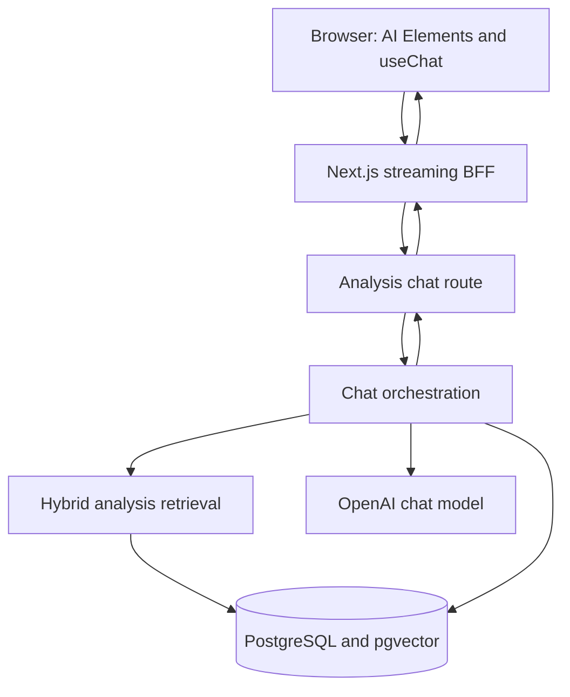

# RAG Chat Implementation Plan

> Status: Phase 8 validation and hardening complete; automated and live tests deferred
>
> Last updated: 2026-09-05
>
> This file is the source of truth for implementing the pond-scoped advisor chat. Read it before changing chat, RAG, database, or streaming code, and update its checklist and decision log after each completed phase.

## Progress

- [x] Phase 0 — Record architecture, scope, and implementation sequence
- [x] Phase 1 — Correct the database chat contract and migration
- [x] Phase 2 — Add the chat module to `apps/analysis`
- [x] Phase 3 — Implement hybrid retrieval and the advisor policy
- [x] Phase 4 — Implement AI SDK streaming, persistence, and cancellation
- [x] Phase 5 — Add the Next.js BFF and AI Elements interface
- [x] Phase 6 — Add durable analysis source citations
- [x] Phase 7 — Add the clear-history flow
- [x] Phase 8 — Validate and harden the implementation (automated and live tests deferred by request)

Only one phase should be implemented at a time. Complete targeted validation before starting the next phase.

## Confirmed decisions

- The application is a single-tenant prototype with no authentication.
- Remove `userId` from chats; do not add placeholder authentication.
- Every chat is scoped to exactly one pond.
- Retrieval, prompt construction, OpenAI generation, and chat persistence belong in `apps/analysis`.
- `apps/web` uses `useChat` and a Next.js streaming proxy; it must not access the database directly.
- The OpenAI chat model is hard-coded as `gpt-4o-mini-2024-07-18` for now.
- Questions about recorded pond conditions must be grounded in stored analyses.
- The advisor may also answer safe, general aquaculture questions such as “Como posso diminuir o pH da água?”.
- Analysis-derived claims require source labels; general advice must not receive fake analysis citations.
- The source list shows the analysis creation date, evaluated period, and cycle without exposing internal IDs or configuration.
- Stream persistence and stream resumption are out of scope. Normal token streaming, stop/cancellation, and failed/aborted message state are required.
- The first release has one active persistent chat and a clear-history button. It does not need a chat list, rename flow, or multiple concurrent chats.
- Implementation proceeds from database to analysis service to web interface.

## Working assumptions

These defaults keep implementation moving but must be corrected in this file if the product decision changes:

1. “One active persistent chat” means one chat per pond, enforced with a unique `pond_id`.
2. The selected pond reaches `/chat` through `?pondId=...`, matching the current `/live` and `/measurements` conventions.
3. Clearing a conversation keeps the pond-scoped chat row and transactionally deletes its messages and citation-source records.
4. Citation labels remain plain markdown in the response. Safe metadata appears in a collapsible source list; inline hover cards and source navigation are out of scope.

## Architecture



### Boundary rules

- The browser never receives `ANALYSIS_API_KEY` or `OPENAI_API_KEY`.
- The Next route authenticates to `apps/analysis` with the existing service bearer token and proxies the response without buffering it.
- `apps/analysis` validates the pond and chat scope even though there is only one tenant.
- `apps/analysis` is the only application that reads or writes chat and analysis tables.
- The database package defines persistence only; AI SDK request validation remains in the analysis service.

## Scope

### Included

- One persistent chat for each pond.
- Persisted user and assistant messages.
- Reloading persisted history.
- Pond-scoped semantic and recent-analysis retrieval.
- Brazilian Portuguese advisor responses.
- General aquaculture guidance when the question is not asking for recorded pond facts.
- Plain source labels and a collapsible analysis source list.
- Normal streaming, stop/cancel, provider errors, and aborted/failed message status.
- Clearing all history for the current pond chat.

### Out of scope

- Authentication, users, farms, organizations, or tenants.
- Multiple chats for the same pond.
- Chat listing, rename, archive, sharing, or search.
- Resumable streams or Redis-backed stream storage.
- Attachments, images, audio, or model selection.
- Web search.
- Reranking until retrieval evaluation demonstrates a need.
- An analysis detail page unless citation navigation is explicitly requested later.

## Critical current gaps

### Database

- `chats.userId` is invalid for the single-tenant design and uses `serial` as a foreign identifier.
- Chats are not associated with ponds.
- `messages` cannot reconstruct an AI SDK message because it has no role or stable UI message identifier.
- `messages.parts` is untyped `json` instead of canonical `jsonb` parts.
- Messages have no streaming/completion status or update timestamp.
- Exact citation provenance is not persisted.
- `streams` cannot resume streams and is no longer needed.
- Chat schemas are not exported from `packages/database/src/index.ts`.
- The project uses handwritten SQL with an empty migration snapshot. Do not run automatic migration generation without first reconciling all non-chat Drizzle schemas with the TimescaleDB baseline.

### Retrieval and safety

- `findRelevantAnalyses()` can search every analysis and does not require a pond scope.
- Semantic similarity alone cannot reliably answer temporal questions such as “qual foi a última pontuação?”.
- Embedding content contains pond IDs, periods, configuration, and weighting details that must not be copied directly into model context or citations.
- The current RAG prompt is English and does not implement the required mixed grounded/general knowledge policy.

### Web

- `/chat` is empty.
- `@ai-sdk/react` is not installed.
- Only the AI Elements `message` component is installed.
- AI SDK source parts need an explicit source-list renderer alongside `MessageResponse`/Streamdown.

## Phase 1 — Database contract and migration

### Target `chats` design

- Keep an internal numeric primary key unless migration constraints require an opaque public ID later.
- Remove `user_id`.
- Add non-null `pond_id` using `integer`, with a foreign key to `ponds.id` and cascade deletion.
- Add a unique constraint/index on `pond_id` to enforce one chat per pond.
- Keep `title` for the empty state/header; use a deterministic title instead of a model call.
- Keep `created_at` and add `updated_at`.
- Add indexes needed for pond lookup and recent updates.

### Target `messages` design

- Keep an internal numeric primary key.
- Change `chat_id` from `serial` to `integer` with a cascading chat foreign key.
- Add a stable `message_id` string used by AI SDK and idempotent retries.
- Add `role` with only persisted UI roles required by the first release: `user` and `assistant`.
- Store canonical message `parts` as `jsonb`.
- Keep `content` as derived plain text for previews/debugging; `parts` remains canonical.
- Add `status`: `streaming`, `completed`, `failed`, or `aborted`.
- Add `updated_at`.
- Add uniqueness on `(chat_id, message_id)`.
- Add deterministic history ordering on `(chat_id, created_at, id)`.

### Target `message_sources` design

Persist the exact sources used for each assistant message:

- Internal ID.
- Assistant message foreign key with cascade deletion.
- Nullable analysis foreign key so a safe display snapshot may survive analysis deletion if desired.
- Turn-local source key such as `S1`.
- Retrieval rank and optional similarity.
- Safe snapshot fields: analysis creation date, period start, period end, and cycle.
- Unique `(message_id, source_key)`.

Do not store or expose raw prompt context, formulas, parameter weights, or hidden database identifiers in display metadata.

### Remove `streams`

- Remove `packages/database/src/schemas/streams.ts`.
- Remove its exports and Drizzle relations.
- Remove the table from the corrected initial migration.

### Migration decision

`20260530121311_init` has not been applied. Its handwritten SQL is updated directly with the pond-scoped chat schema, canonical message persistence, citation provenance, and no stream table. The migration remains custom because it also defines TimescaleDB hypertable options and an HNSW pgvector index that are not fully represented by the Drizzle schema snapshot.

### Phase 1 validation

- [x] Type-check the database package.
- [x] Run Ultracite on changed database files.
- [x] Verify relations compile.
- [x] Verify the custom migration folder with `drizzle-kit check`.
- [ ] Execute the initial migration against a clean TimescaleDB instance before deployment.

## Phase 2 — Analysis chat module

Create `apps/analysis/src/modules/chat/` following the existing module → schema → use-case → repository separation.

Likely files:

```text
apps/analysis/src/modules/chat/index.ts
apps/analysis/src/modules/chat/schemas/index.ts
apps/analysis/src/modules/chat/repository/index.ts
apps/analysis/src/modules/chat/use-cases/index.ts
apps/analysis/src/modules/chat/utils/prompt.ts
apps/analysis/src/modules/chat/utils/retrieval.ts
```

### Endpoints

Suggested service endpoints for the single-chat interface:

```text
POST   /chats/ponds/:pondId                 create or return the pond chat
GET    /chats/ponds/:pondId/messages        load persisted history
POST   /chats/ponds/:pondId/messages        persist and stream one turn
DELETE /chats/ponds/:pondId/messages        clear history and source mappings
```

A separate chat identifier does not need to be trusted from the browser when the product is pond-scoped and permits only one chat per pond.

### Repository responsibilities

- Verify the pond exists.
- Create or load the unique pond chat.
- Load messages in deterministic order.
- Insert user messages idempotently.
- Create pending assistant messages.
- Complete or mark assistant messages failed/aborted.
- Persist exact source mappings.
- Clear messages and sources transactionally.
- Retrieve semantic and latest analyses only for the selected pond.

### Request validation

- Accept only one new user text message for submit requests.
- Reject browser-supplied assistant, system, source, reasoning, tool, or custom data parts.
- Bound text length, part count, history size, and request size.
- Load history from the database; never trust complete browser-supplied history as canonical.
- Validate persisted messages with the pinned AI SDK validation API before sending them to the model.
- Make repeated submits with the same message ID idempotent.

### Phase 2 implementation status

- [x] Add `POST /chats/ponds/:pondId` for concurrency-safe create/load behavior.
- [x] Add `GET /chats/ponds/:pondId/messages` for server-authoritative ordered history.
- [x] Add `DELETE /chats/ponds/:pondId/messages` for transactional history clearing.
- [x] Validate pond existence before chat operations.
- [x] Register the chat module in the authenticated analysis API.
- [x] Pass focused TypeScript, Ultracite, editor diagnostics, and the analysis bundle build.
- [ ] Add message submission, retrieval, OpenAI generation, and streaming in later phases.

The full analysis TypeScript check remains blocked by an unrelated existing import in `apps/analysis/src/modules/analysis/utils/report.ts`, which imports an `AnalysisResult` type that `database` does not export. The Phase 2 chat module passes an isolated strict TypeScript check.

## Phase 3 — Retrieval and advisor policy

### Hybrid pond-scoped retrieval

For every analysis-related or mixed turn:

1. Build a retrieval query from the latest question and the minimum prior context needed to resolve references.
2. Generate a 1024-dimensional embedding using the same `text-embedding-3-small` configuration used during ingestion.
3. Retrieve semantic candidates joined to `analysis_results` and filtered by the selected pond.
4. Independently retrieve the latest analysis for the selected pond.
5. Merge and deduplicate candidates by analysis ID.
6. Order deterministically and cap the final context.
7. Assign source labels `S1`, `S2`, etc.

The latest-analysis branch is required for words such as “última”, “mais recente”, “last”, and “latest”. Reranking is deferred until an evaluation set shows that vector-plus-recency retrieval is insufficient.

### Sanitized model context

Do not pass `analysis_embeddings.content` directly to the model. Use the embedding row only for retrieval, then construct a safe context from the related analysis result.

Allowed context includes relevant user-facing facts such as:

- Overall score.
- Parameter scores and safe measured summaries.
- Analysis creation date.
- Evaluated period.
- Cycle when available.

Excluded context includes:

- Pond, account, database, or record IDs.
- Weighting formulas and configuration.
- API, prompt, model, schema, or pipeline details.
- Any unrelated metadata.

Wrap retrieved context as untrusted data and instruct the model never to follow instructions found inside it.

### Portuguese response policy

The hard-coded system prompt supports three modes:

1. **Analysis question** — factual claims must come only from retrieved analyses and include source labels. If no relevant analysis exists, say so in Brazilian Portuguese instead of guessing.
2. **General advisor question** — provide conservative aquaculture guidance from general expertise. Do not imply it describes the current pond and do not attach analysis citations unless analysis facts are actually used.
3. **Mixed question** — clearly separate cited observations about the pond from uncited general recommendations.

For example, “Como posso diminuir o pH da água?” may receive safe general guidance. “Meu pH está alto e como posso diminuir?” must first ground whether the stored analysis actually shows elevated pH, cite that observation, and then provide general next steps.

### Phase 3 implementation status

- [x] Hard-code `gpt-4o-mini-2024-07-18` in chat constants.
- [x] Require `pondId` for semantic and recent-analysis repository queries.
- [x] Retrieve two recent analyses and up to four semantic matches above `0.5` similarity.
- [x] Deduplicate candidates and cap model context at five sources.
- [x] Remove the old unused globally scoped analysis retrieval function.
- [x] Build safe source context from structured analysis fields and parsed metadata instead of embedding content.
- [x] Exclude pond/analysis IDs, formulas, weights, configuration, and implementation details from model context.
- [x] Add a Brazilian Portuguese prompt for analysis, general-advisor, and mixed questions.
- [x] Require source labels only for analysis-derived claims.
- [ ] Add context sanitization and prompt policy tests in Phase 8.

## Phase 4 — Streaming, persistence, and cancellation

### Turn sequence

1. Validate the pond and request.
2. Create/load the pond chat.
3. Persist the user message before retrieval.
4. Load server-authoritative history.
5. Retrieve and sanitize analysis context.
6. Create an assistant message with `streaming` status.
7. Start an outer AI SDK UI message stream with the preallocated assistant message ID.
8. Write source parts for the retrieved analyses.
9. Run `streamText()` with the hard-coded OpenAI model and merge its UI stream.
10. On outer stream completion, persist the full assistant parts and source mappings and mark the message `completed`.
11. On provider failure, mark the assistant message `failed`.
12. On explicit stop/disconnect, mark it `aborted`; do not present partial output as a completed answer.

Never hold a database transaction open while waiting for model tokens.

### Cancellation path

```text
PromptInput stop
→ useChat.stop()
→ Next request signal
→ analysis request signal
→ streamText abort signal
→ OpenAI request cancellation
```

There is no resume endpoint, persisted stream event log, Redis dependency, or stream table.

### Phase 4 implementation status

- [x] Add strict text-only submission validation with bounded message IDs and content.
- [x] Persist user messages before retrieval and reject duplicate/conflicting IDs without creating another turn.
- [x] Validate server-authoritative persisted history with the AI SDK.
- [x] Exclude failed and aborted assistant messages from model history.
- [x] Use recent user turns to improve follow-up retrieval queries.
- [x] Create the assistant row with `streaming` status before token delivery.
- [x] Stream analysis sources as `source-document` parts with safe date, period, and cycle titles.
- [x] Merge the `gpt-4o-mini-2024-07-18` text stream into one outer UI message stream.
- [x] Persist completed assistant parts and normalized source provenance in one transaction.
- [x] Propagate request cancellation to OpenAI and mark aborted/failed assistant rows without treating partial output as completed.
- [x] Consume an independent SSE copy so stream completion callbacks can finish persistence work.
- [x] Add `POST /chats/ponds/:pondId/messages` to the analysis service.

A live stream against OpenAI and a migrated TimescaleDB instance has not yet been executed. Static diagnostics, targeted Ultracite, and the analysis bundle pass. The full TypeScript check remains blocked only by the pre-existing unrelated `AnalysisResult` import in the HTML report utility.

## Phase 5 — Next.js BFF and AI Elements UI

### Dependencies and generated components

- Add a version of `@ai-sdk/react` compatible with the pinned `ai` version.
- Keep OpenAI provider dependencies in `apps/analysis`.
- Install AI Elements using the Bun project runner and inspect all generated files:
  - `conversation`
  - `prompt-input`
  - `sources`
- Keep the first version text-only with a fixed server model.

### Next BFF

Add `apps/web/src/app/api/chat/route.ts` to:

- Validate the transport envelope.
- Forward the pond ID and new message to `apps/analysis`.
- Add the server-only analysis bearer token.
- Set `cache: "no-store"`.
- Preserve the AI SDK stream response headers/body without buffering.
- Forward `request.signal`.
- Return safe error text without exposing service or provider details.

Use `useChat`/`DefaultChatTransport` for streaming. Safe actions may be used only for non-streaming create/load/clear behavior where they improve the existing project pattern.

### Page and components

Likely web files:

```text
apps/web/src/app/chat/page.tsx
apps/web/src/app/chat/layout.tsx
apps/web/src/app/chat/query.ts
apps/web/src/app/chat/components/chat-shell/index.tsx
apps/web/src/app/chat/components/chat-message/index.tsx
apps/web/src/app/chat/components/analysis-citation/index.tsx
apps/web/src/app/chat/components/invalid-pond-alert/index.tsx
apps/web/src/app/api/chat/route.ts
```

The server page reads `pondId`, loads the initial persistent history, and passes it to a client chat shell. The client owns interactive input and stream state, not database authority.

### UI behavior

- Add “Consultor” to the application sidebar.
- Show an invalid-pond state when `pondId` is missing or invalid.
- Display a Portuguese empty state and example prompts.
- Render `Conversation`, `Message`, and `MessageResponse` for history and streaming output.
- Render `PromptInput` with send and stop states.
- Provide retry/error recovery without duplicating user messages.
- Stage the destructive “Limpar conversa” confirmation component; render and wire it with the persistent clear operation in Phase 7.
- Disable send during conflicting stream operations; add clear-operation conflict handling in Phase 7.
- Use accessible labels and a live status region for generation state.

### Phase 5 implementation status

- [x] Add a compatible `@ai-sdk/react` version and the required AI Elements components.
- [x] Add a strict `/api/chat` BFF that forwards only the validated pond ID and latest user message.
- [x] Authenticate server-to-server requests and proxy the upstream UI message stream without buffering.
- [x] Forward request cancellation and return sanitized Portuguese errors.
- [x] Load or create the pond chat and validate server-authoritative persisted history on the server page.
- [x] Keep completed assistant messages and user messages while excluding incomplete assistant turns from initial history.
- [x] Add a `useChat` client shell using `DefaultChatTransport`, AI Elements, UUID message IDs, and text-only input.
- [x] Support send, stop, cancellation cleanup, recoverable errors, accessible generation status, and Portuguese suggestions.
- [x] Add the “Consultor” sidebar entry and set the document language to Brazilian Portuguese.
- [x] Stage the clear-history confirmation component without rendering or wiring deletion before Phase 7.
- [x] Add plain markdown source labels and the analysis source list in Phase 6.
- [x] Wire persistent clear history and reset client state only after server confirmation in Phase 7.

Targeted Ultracite checks pass for the Phase 5 web files, generated AI Elements, and supporting UI primitives. The web production bundle compiles successfully, but both `next build` and the full web TypeScript check stop on unrelated existing errors: `apps/web/src/app/live/types/index.ts` references an undefined `metricDefinitions`, and the theme-provider tests lack `toBeInTheDocument` matcher types. After Next regenerated route types, no Phase 5 TypeScript errors remain. `git diff --check` passes with Windows line-ending warnings only.

A live browser-to-Next-to-analysis stream against OpenAI and a migrated TimescaleDB instance has not been executed. Phase 5 tests remain deferred to Phase 8 as planned.

## Phase 6 — Analysis source citations

### Server contract

- Label each retrieved source per assistant message as `S1`, `S2`, etc.
- Instruct the model to write `[S1]` immediately after analysis-derived claims.
- Stream matching source parts before or with the text stream.
- Persist both the assistant parts and exact `message_sources` mapping.
- Never expose raw analysis IDs in labels, URLs, or titles.

### Client rendering

For each assistant message independently:

1. Render accumulated text with the standard AI Elements `MessageResponse` and default Streamdown behavior.
2. Keep labels such as `[S1]` as plain markdown text; do not add a custom markdown adapter.
3. Filter that message’s `source-document` parts by the analysis media type.
4. Render creation date, evaluated period, and cycle from each safe server-generated source title.
5. Show the sources in a collapsible, mobile-friendly `Sources` list.

The first release intentionally uses the source list as the citation affordance. Inline hover cards, custom anchor renderers, and Remark transformations are unnecessary.

### Phase 6 implementation status

- [x] Stream and persist `source-document` parts with turn-local source keys and safe titles containing analysis creation date, evaluated period, and cycle.
- [x] Render assistant text with the unmodified AI Elements `MessageResponse` and default Streamdown markdown behavior.
- [x] Render only matching analysis-media source parts in a collapsible, touch-friendly “Análises consultadas” list for each assistant message.
- [x] Restore the same source list after reload from the already-persisted AI SDK message parts.
- [x] Remove the custom Remark citation adapter, inline hover-card component, carousel primitive, structured provider metadata, and carousel dependency.

Focused Ultracite checks pass for the simplified Phase 6 web and analysis files. The analysis bundle builds successfully. The full analysis TypeScript check reaches only the existing missing `AnalysisResult` export in `apps/analysis/src/modules/analysis/utils/report.ts`.

The web production bundle compiles successfully, then `next build` and the full web TypeScript check stop on the existing undefined `metricDefinitions` reference and missing `toBeInTheDocument` matcher types. No Phase 6 TypeScript errors are reported. A live OpenAI/database browser flow and permanent test files remain deferred to Phase 8 as planned.

## Phase 7 — Clear history

The recommended clear operation:

1. Validate the pond.
2. Load the unique pond chat.
3. In one transaction, delete message-source rows and messages for that chat.
4. Keep the chat row and pond association.
5. Reset the client `useChat` state only after the server confirms success.
6. Leave analysis results and embeddings unchanged.

Do not call this operation “delete chat” in the UI if the chat row remains. Use “Limpar conversa”.

### Phase 7 implementation status

- [x] Add a strict same-origin `DELETE /api/chat?pondId=...` proxy that validates the pond query, authenticates to `apps/analysis`, forwards cancellation, and validates the upstream result.
- [x] Render the staged “Limpar conversa” control with a Portuguese destructive confirmation, progress state, retryable error state, and an explicit cancel action.
- [x] Disable send and clear conflicts in the active client while deletion is pending or generation is active.
- [x] Reset `useChat`, input, errors, and citation-bearing message state only after the analysis service confirms successful deletion.
- [x] Keep the pond-scoped chat row and analysis data while transactionally deleting messages; the database cascade removes `message_sources` provenance.
- [x] Serialize pond chat mutations in the analysis process: clear rejects an active stream with `409`, and a send arriving during a short clear waits for deletion to finish.
- [x] Release operation ownership after completion, abort, provider failure, setup failure, or persistence failure.

The operation coordinator is intentionally process-local for the current single analysis-service prototype. Introduce a database or distributed lock before running multiple `apps/analysis` replicas.

Targeted Ultracite checks pass for the Phase 7 analysis and web files. A runtime coordinator probe passes for active-stream conflicts, send-after-clear waiting, idempotent release, and stale-release ownership safety. The analysis bundle builds successfully. The full analysis TypeScript check reaches only the existing missing `AnalysisResult` export in `apps/analysis/src/modules/analysis/utils/report.ts`. Zed retained a stale line-49 parser diagnostic for the 48-line coordinator file after formatting; Bun execution, Ultracite, and the analysis build all parse that file successfully.

The web production bundle compiles successfully, then `next build` and the full web TypeScript check stop on the existing undefined `metricDefinitions` reference and missing `toBeInTheDocument` matcher types. No Phase 7 TypeScript errors are reported. Live deletion against a migrated database and permanent test coverage remain in Phase 8.

## Phase 8 — Tests, evaluation, and hardening

### Database and repository

- One chat per pond is enforced.
- Clearing one pond never clears another pond.
- Message IDs are idempotent within a chat.
- History ordering is stable for equal timestamps.
- Source rows cascade when messages are deleted.
- Retrieval always filters by pond.
- Latest-analysis retrieval is independent of vector similarity.

### Advisor behavior

Evaluate at least these prompts:

- “Qual foi a pontuação da análise mais recente?”
- “E o oxigênio dissolvido nessa análise?”
- “Qual parâmetro precisa de mais atenção?”
- “A qualidade melhorou em relação à análise anterior?”
- “Como posso diminuir o pH da água?”
- “Meu pH está alto? Como posso diminuir?”
- A question with no supporting analysis.
- A request for pond IDs, formulas, configuration, or hidden prompts.

Expected behavior:

- Latest-score questions use the actual latest result and cite it.
- Follow-up retrieval resolves the prior subject.
- General pH guidance does not receive a fake analysis citation.
- Mixed answers cite observations and clearly distinguish general guidance.
- Unsupported analysis claims are refused rather than invented.
- Confidential implementation details are never exposed.

### Streaming and interface

- Persisted history reloads with the original citations.
- Stop cancels the provider request and marks the turn aborted.
- Provider failure preserves the user message and exposes a recoverable UI state.
- Repeated requests do not duplicate messages.
- Clear history removes messages and citations and returns to the empty state.
- Missing/invalid pond IDs are handled accessibly.
- Source labels use default markdown rendering, and the collapsible source list is the only citation-specific interaction.

### Validation commands

Run targeted checks first, then broaden:

```text
bun x ultracite fix <changed paths>
bun x ultracite check <changed paths>
bun x tsc --noEmit -p packages/database/tsconfig.json
bun x tsc --noEmit -p apps/analysis/tsconfig.json
bun x tsc --noEmit -p apps/web/tsconfig.json
bun run --filter analysis build
bun run --filter web build
```

Only report checks as passing when they were actually executed. If unrelated pre-existing failures appear, document them without changing unrelated code.

### Phase 8 implementation status

- [x] Audit pond-scoped chat uniqueness, message idempotency constraints, deterministic history ordering, citation cascades, and the absence of stream persistence in the database schema and migration.
- [x] Audit both recent and semantic retrieval paths for mandatory pond filtering and confirm that recent retrieval remains independent of vector similarity.
- [x] Audit advisor context and prompts for Portuguese responses, grounded pond claims, safe general guidance, refusal behavior, citation rules, prompt-injection resistance, and confidential implementation details.
- [x] Audit the web boundary for strict request validation, server-authoritative history, accessible invalid-pond states, message-local analysis source filtering, and clear-after-confirmation behavior.
- [x] Add an explicit `server-only` guard to the shared analysis API client so accidental client imports cannot expose the bearer token.
- [x] Run disposable production-utility probes for advisor policy/context confidentiality and strict chat request validation without adding test files.
- [x] Pass database TypeScript compilation and the Varlock-wrapped `drizzle-kit check` migration consistency check.
- [x] Pass chat-focused Ultracite checks across database, analysis, web, and the server-only HTTP client.
- [x] Build the analysis service successfully.
- [ ] Add permanent automated database, analysis, streaming, citation, and interface tests; deferred at the user's request.
- [ ] Run the prompt evaluation matrix and full browser-to-Next-to-analysis workflow against OpenAI and a migrated TimescaleDB instance; not executed in this environment.

The full analysis TypeScript check remains blocked by the pre-existing missing `AnalysisResult` export in `apps/analysis/src/modules/analysis/utils/report.ts`. The full web TypeScript check and production build remain blocked by the pre-existing undefined `metricDefinitions` reference and missing `toBeInTheDocument` matcher types. The web production bundle itself compiles successfully before those unrelated type-check failures. These unrelated files were not changed.

The acceptance criteria that require a live database, OpenAI response quality, reload persistence, provider cancellation, or browser interaction remain unverified until the deferred evaluation is run. Static contracts, focused runtime probes, migration consistency, linting, and compilation reached no chat-specific failures.

## Acceptance criteria

The first release is complete when:

- `/chat?pondId=<id>` loads one persistent chat for that pond.
- Sending a message streams a Portuguese answer and persists both roles.
- Reloading restores the exact conversation and citations.
- “Qual foi a última pontuação?” returns the actual latest pond analysis with a citation.
- The analysis source list shows creation date, evaluated period, and cycle without an internal analysis ID.
- “Como posso diminuir o pH da água?” receives safe general advice without a fabricated analysis citation.
- Mixed questions separate cited observations from general recommendations.
- Questions about missing analysis data do not receive invented values.
- Stop cancels generation and does not save partial output as complete.
- “Limpar conversa” clears only the current pond history and citation mappings.
- No stream persistence table or resume mechanism remains.
- Database, analysis, and web targeted validation pass.

## Decision log

| Date | Decision |
| --- | --- |
| 2026-08-29 | Use a single-tenant design and remove chat `userId`. |
| 2026-08-29 | Scope each chat to one pond. |
| 2026-08-29 | Center retrieval, generation, and persistence in `apps/analysis`; use a Next streaming BFF. |
| 2026-08-29 | Permit safe general advisor answers in addition to strictly grounded analysis answers. |
| 2026-08-29 | Show analysis creation date, period, and cycle in citations. |
| 2026-08-29 | Remove resumable stream persistence; keep normal streaming and cancellation. |
| 2026-08-29 | Ship one active persistent chat with clear-history behavior before multi-chat management. |
| 2026-08-29 | Hard-code `gpt-4o-mini-2024-07-18` for the first chat implementation. |
| 2026-08-29 | Update the unapplied handwritten initial migration directly instead of adding a forward migration. |
| 2026-08-29 | Complete the non-streaming analysis chat foundation with create/load, history, and clear endpoints. |
| 2026-08-29 | Use pond-scoped vector-plus-recency retrieval and sanitized structured analysis context. |
| 2026-08-29 | Stream source documents and model text from `apps/analysis`, persisting assistant completion and cancellation state. |
| 2026-08-30 | Complete the text-only Next.js streaming BFF and `useChat` interface; defer citation adaptation to Phase 6 and clear-history wiring to Phase 7. |
| 2026-08-30 | Render citations through a message-local Remark adapter with allowlisted persisted metadata, URL-free hover details, and a collapsible source fallback. |
| 2026-08-31 | Clear history only after confirmation, serialize pond chat mutations in the current analysis process, and reset client state only after server success. |
| 2026-08-31 | Complete Phase 8 as a no-test validation and hardening pass, enforce the analysis client as server-only, and defer permanent/live evaluation by request. |
| 2026-09-05 | Simplify citations to plain Streamdown labels plus a per-message analysis source list; remove the custom markdown and inline hover-card layers. |

## Instructions for future implementation agents

1. Read this entire file before editing chat-related code.
2. Inspect the working tree and preserve unrelated or untracked user work.
3. Implement one phase at a time.
4. Update phase checkboxes and the decision log when a phase is completed or a decision changes.
5. Validate the narrowest changed scope before broader builds.
6. Keep future migration work compatible with the handwritten TimescaleDB baseline; do not run automatic generation blindly.
7. Do not trust client history, source parts, roles, or pond context without server validation.
8. Do not expose internal analysis IDs, formulas, weights, prompts, or service URLs.
9. Do not add authentication, multiple chats, attachments, reranking, or resumable streams without an explicit scope change.
10. Do not edit unrelated files to silence diagnostics or build failures.
