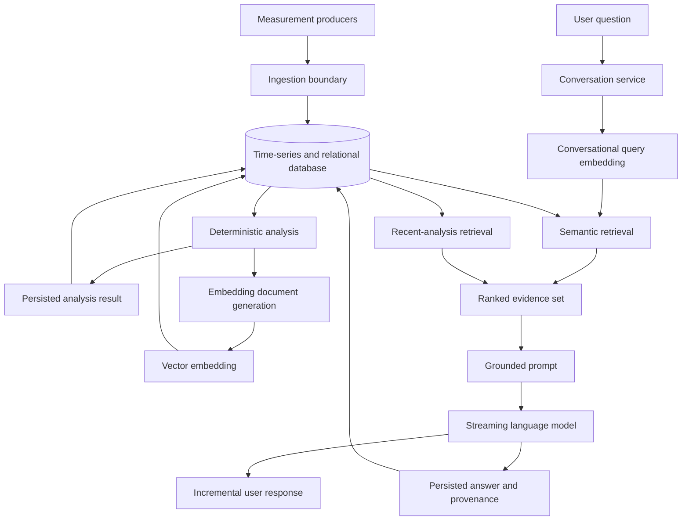
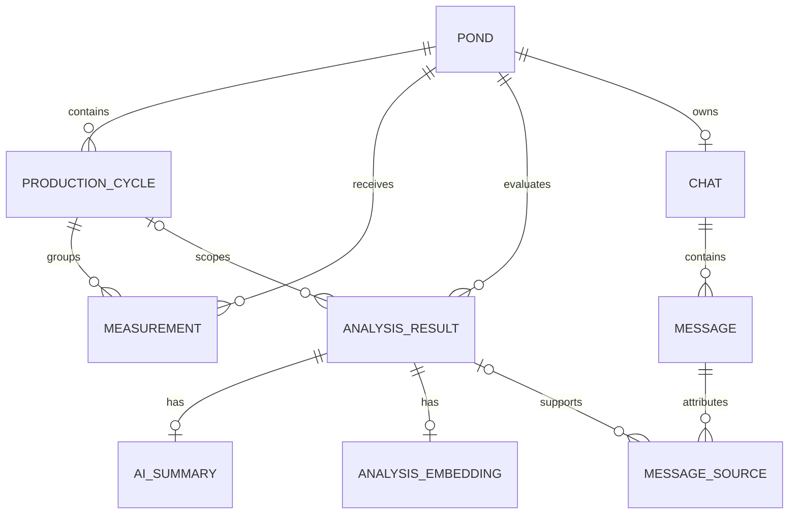

# Implementation Reference: Time-Series Analysis and Retrieval-Augmented Conversational Assistance

## 1. Purpose and scope

This document describes the production implementation of Report Flow from a conceptual and technical perspective. It is intended to serve as a primary reference for writing the implementation section of an academic paper. The emphasis is on algorithms, data models, processing semantics, architectural decisions, and reproducible behavior rather than on framework-specific syntax.

The implementation can be reproduced with different programming languages, web frameworks, database access libraries, model providers, or user-interface technologies, provided that the same invariants and processing rules are maintained.

The following production areas are covered:

- acquisition and validation of water-quality measurements;
- relational and time-series data modeling;
- time-series query and indexing strategies;
- deterministic normalization and temporal scoring;
- coverage and unfavorable-interval detection;
- persistence of analytical results;
- generation and storage of vector embeddings;
- semantic similarity search and source ranking;
- retrieval-augmented generation (RAG);
- prompt construction and epistemic constraints;
- conversational state and message persistence;
- response streaming and failure handling;
- presentation of measurements, analyses, sources, and generated answers;
- reproducibility requirements and known implementation limitations.

The evaluation and simulation applications are intentionally outside the scope of this document because they are auxiliary validation tools rather than parts of the production data flow.

---

## 2. System overview

The system is organized around four production responsibilities:

1. **Data acquisition** receives pond, cycle, and measurement data and validates the structural relationships between them.
2. **Analytical processing** reads time-series measurements, normalizes environmental parameters, calculates temporal and aggregate scores, and persists analytical artifacts.
3. **Conversational assistance** retrieves relevant analytical artifacts and uses them as evidence for a streamed natural-language response.
4. **Presentation** exposes historical measurements, near-real-time aggregates, and the conversational interface through a web application.

A shared database connects these responsibilities. Measurement data is treated as a time series, while analyses, embeddings, chats, messages, and source provenance are represented relationally.



This division separates deterministic environmental computation from probabilistic language generation. The final analytical score does not depend on the language model. The model is used only to produce an optional narrative summary and to answer conversational questions using persisted analytical evidence.

### 2.1 Architectural principles

The implementation follows these principles:

- **Deterministic core, probabilistic interface:** environmental scores are produced by explicit formulas; generated text cannot change them.
- **Append-oriented analytical history:** repeated analyses produce independent historical records instead of mutating previous records.
- **Evidence-oriented generation:** conversational responses receive a bounded set of analytical sources and are instructed to distinguish evidence from general knowledge.
- **Explicit temporal semantics:** score computation defines interval boundaries, continuity limits, duration weighting, and missing coverage.
- **Persisted provenance:** each completed assistant response stores the analytical sources retrieved for that response.
- **Streaming interaction:** sources and generated text are sent incrementally to reduce perceived latency.
- **Service separation:** ingestion, analysis/conversation, and presentation have independent boundaries even though they share a database and domain model.

---

## 3. Domain model

### 3.1 Main entities

The data model contains the following conceptual entities:

- **Pond:** the physical or logical water body being monitored.
- **Production cycle:** a dated period associated with one pond.
- **Measurement:** one observed environmental value at a timestamp.
- **Analysis result:** a deterministic evaluation of a pond over a requested period.
- **AI summary:** an optional narrative interpretation associated one-to-one with an analysis.
- **Analysis embedding:** an optional dense vector and its exact source document, associated one-to-one with an analysis.
- **Chat:** the persistent conversation associated with a pond.
- **Message:** one user or assistant conversational turn.
- **Message source:** a provenance record connecting an assistant response to a retrieved analysis.



### 3.2 Measurement identity

A measurement is identified semantically by:

\[
(pond, parameter, timestamp)
\]

A uniqueness constraint prevents two measurements for the same pond and parameter at the same timestamp. This acts as partial duplicate protection, but not full request idempotency:

- retries with exactly the same natural key cannot create another row;
- a retry currently receives a uniqueness error rather than the original success result;
- source, cycle, unit, and value are not part of the natural key;
- a corrected measurement at the same timestamp requires replacement rather than an additional record.

The measurement also references both a pond and a production cycle. A composite foreign-key relationship verifies that the selected cycle belongs to the selected pond. This prevents cross-pond associations even if an API client submits inconsistent identifiers.

### 3.3 Analysis identity and historical behavior

An analysis stores:

- pond and optional cycle identifiers;
- requested start and end timestamps;
- one score for each required parameter;
- the final weighted score;
- detailed structured metadata;
- creation time.

There is deliberately no uniqueness constraint over pond, period, and model version. Repeating an analysis creates a new record. Therefore, the table represents a history of analytical executions rather than a materialized cache.

This behavior is relevant for retrieval: multiple analyses may describe the same pond and period, and their creation timestamps can influence ranking or recency selection.

### 3.4 Conversation cardinality

The physical schema permits at most one chat per pond. Messages within that chat are ordered by creation time and a monotonically increasing database identifier as a deterministic tie-breaker.

Message identifiers are generated by the client and are unique within a chat. Duplicate message IDs are rejected, which prevents duplicate submission but does not provide complete idempotent replay because the original response is not returned automatically.

---

## 4. Data acquisition and integrity

### 4.1 Ingestion workflow

The ingestion service provides separate operations for:

1. creating a pond;
2. creating a production cycle for a pond;
3. recording one measurement for an existing pond/cycle pair.

The measurement workflow is:

```text
validate request shape
    -> verify that the cycle belongs to the pond
    -> insert one measurement
    -> rely on database keys for final integrity
```

Each measurement includes:

- pond identifier;
- cycle identifier;
- timestamp;
- parameter code;
- numeric value;
- unit;
- source type;
- creation timestamp generated by the database.

The currently supported analytical parameters are:

- dissolved oxygen;
- temperature;
- pH;
- salinity.

### 4.2 Validation layers

Validation is divided into three layers:

1. **Transport validation** verifies the request structure, enum membership, and date parsing.
2. **Application validation** verifies domain relationships such as the cycle belonging to the pond and basic cycle-date ordering.
3. **Database constraints** enforce primary keys, foreign keys, and measurement uniqueness.

This layered model is portable across technologies. A reproduction should preserve final database-level integrity even if application validation already checks the same relationship, because concurrent operations can invalidate assumptions between a read and a later write.

### 4.3 Units and semantic validation

The schema represents parameter codes and unit codes as closed enumerations. However, the current implementation validates them independently. It does not enforce a mapping such as:

```text
temperature      -> degrees Celsius
pH               -> pH units
salinity         -> parts per thousand
dissolved oxygen -> milligrams per liter
```

It also does not enforce biologically plausible numeric ranges at the database boundary. Consequently, the deterministic analysis assumes that ingestion has already supplied values in the correct units and domain.

For reproducibility and stronger scientific validity, an alternative implementation should consider:

- explicit parameter-to-unit constraints;
- admissible measurement ranges;
- measurement timestamps constrained to the selected production cycle;
- source-event identifiers for true idempotency;
- conflict behavior for corrected readings;
- bulk ingestion for high-frequency sensors.

### 4.4 Transaction behavior

Pond creation is a single insertion. Cycle creation and measurement ingestion perform an existence check followed by a separate insertion rather than one application-level transaction.

The database foreign keys remain the definitive integrity mechanism if a concurrent deletion occurs between those operations. A more robust reproduction may combine validation and insertion in one transaction or express the relationship directly in a conditional insertion.

---

## 5. Database organization

### 5.1 Hybrid relational and time-series storage

The database combines three data-access patterns:

- **time-series storage** for measurements;
- **relational storage** for domain entities, analysis results, and conversations;
- **vector storage** for dense embeddings.

Only the measurement table is configured as a time-series hypertable. Analysis and conversation tables remain ordinary relational tables.

This separation is conceptually appropriate because measurements are high-volume, append-oriented, and queried by time range, whereas analyses and conversations have lower volume and richer relational behavior.

### 5.2 Time partitioning and locality

Measurements are partitioned by their observation timestamp. Pond identity is configured as a segment/locality key, and physical ordering favors descending timestamps.

The intended access patterns are:

- all measurements for one pond over a time interval;
- all measurements for one production cycle;
- measurements for one parameter over time;
- newest measurements first for pagination;
- grouped time buckets for near-real-time visualization.

A technology-independent reproduction can use native time partitions, distributed time-series chunks, or manually managed range partitions. The important property is pruning old or unrelated time ranges before reading rows.

### 5.3 Measurement indexes

The implementation maintains indexes supporting:

- pond lookup;
- cycle lookup;
- parameter lookup;
- source-type lookup;
- creation-time lookup;
- combined pond/cycle lookup;
- descending pond/time/identifier traversal;
- descending cycle/time/identifier traversal;
- parameter/time lookup;
- uniqueness by pond, parameter, and timestamp.

The descending compound indexes support stable keyset pagination. Given a cursor containing `(recordedAt, id)`, the next page uses:

\[
recordedAt < cursorTime
\]

or, for equal timestamps:

\[
recordedAt = cursorTime \land id < cursorId
\]

This avoids the increasing cost and instability of offset pagination for large append-only datasets.

The tradeoff is write amplification: each incoming measurement must update several indexes. A reproduction should select indexes from measured query plans rather than automatically duplicating every possible filter.

### 5.4 Analytical indexes

Analysis results are indexed by:

- pond;
- cycle;
- start and end timestamps;
- creation timestamp;
- final score;
- pond plus analytical period;
- start plus end period.

These indexes support historical analysis selection, period filtering, and recent-analysis retrieval.

Structured analytical metadata is stored as a document-oriented column, but no specialized document index is defined because production queries currently retrieve the row and validate metadata in application code rather than filtering deeply inside metadata.

### 5.5 Vector index

Each analysis embedding is a fixed-dimensional vector. An approximate nearest-neighbor graph index is built using cosine distance semantics.

Conceptually, a graph-based approximate index trades a small amount of recall for lower query latency at larger vector counts. It incrementally creates neighborhood relationships between vectors and searches that graph instead of calculating exact distance against every row.

The current index uses default construction and search parameters. No application-specific graph connectivity, construction effort, or query-time search breadth is configured.

For a reproduction, the following should be measured:

- exact-search recall versus approximate-search recall;
- retrieval latency as vector count increases;
- the effect of filtering by pond before or after vector traversal;
- whether the query expression can actually use the approximate index;
- the effect of query-time search breadth on filtered result count.

### 5.6 Time-series features not currently used

The schema does not configure:

- an explicit time-chunk interval;
- automatic retention;
- automatic compression or columnar conversion;
- continuous aggregates;
- aggregate refresh policies;
- gap-filled materialized views;
- additional spatial/hash partitioning.

This distinction is important academically: using a time-series database does not automatically mean every time-series optimization is active. The implemented benefits come primarily from hypertable partitioning, ordering, and targeted indexes.

---

## 6. Measurement query patterns

### 6.1 Raw historical pagination

Historical measurement endpoints return rows in descending temporal order using keyset pagination. The default page size is 25 and the maximum is 100.

The selected scope can be either:

- all measurements for a pond; or
- all measurements for a production cycle.

This design is suited to user interfaces because the newest observations appear first and query cost remains approximately stable as the user advances through pages.

### 6.2 Near-real-time aggregation

The live dashboard uses database-side temporal buckets rather than transferring every raw observation to the browser.

For each bucket, parameter, and unit, the query computes:

- arithmetic mean;
- minimum;
- maximum;
- number of observations;
- last observed value by timestamp.

Supported monitoring windows are 15 minutes, 1 hour, 6 hours, and 24 hours. Supported bucket widths are 15 seconds, 1 minute, 5 minutes, and 15 minutes. The default view is a one-hour window with one-minute buckets.

Only temperature and dissolved oxygen are exposed in the current live view.

The browser polls every 15 seconds, pauses polling when the page is not visible, and avoids starting another request while the previous one is still executing. Results include a generation timestamp, and the client refuses to replace a newer snapshot with an older one. This is a simple protection against out-of-order asynchronous responses.

Empty buckets are omitted. The implementation does not apply gap filling, interpolation, or last-observation carry-forward for visualization.

The live aggregation path is independent from the analytical scoring path. Analytical scores always operate on raw measurement rows.

---

## 7. Deterministic analytical model

### 7.1 Required parameter set

An analysis requires at least one measurement for each of the four parameters:

\[
P = \{DO, T, pH, S\}
\]

where:

- \(DO\) is dissolved oxygen;
- \(T\) is temperature;
- \(S\) is salinity.

If any parameter is entirely absent, the analysis is rejected as insufficient data. Presence and coverage are different concepts: a single measurement satisfies presence, even if temporal coverage is very low.

### 7.2 Half-open analytical window

Pond analysis uses a half-open interval:

\[
[T_0, T_1)
\]

A measurement at \(T_0\) is included, while a measurement exactly at \(T_1\) is excluded. Half-open intervals avoid overlap when adjacent analytical windows share a boundary.

The available named periods are 7, 30, and 90 days, plus a custom interval. Explicit start and end timestamps override the named duration when both are supplied.

Cycle analysis loads the complete cycle measurement set. Its analytical end is the latest global measurement timestamp plus the expected collection interval of 10 seconds, allowing the final observation to contribute a bounded duration.

### 7.3 Normalization objective

Measurements have different units and optimal ranges. The system maps every raw value \(x\) to a common suitability score:

\[
s(x) \in [1,100]
\]

A value of 100 represents the configured optimum, while 1 represents the minimum score. The lower bound is 1 instead of 0 to preserve a nonzero analytical floor.

### 7.4 Gaussian suitability curves

Temperature, pH, and salinity use symmetric Gaussian curves:

\[
s(x) = \operatorname{clip}_{[1,100]}
\left(
1 + 99\exp\left[-\frac{(x-\mu)^2}{2\sigma^2}\right]
\right)
\]

where:

- \(\mu\) is the optimum;
- \(\sigma\) controls tolerance around the optimum.

Current parameters are:

| Parameter | \(\mu\) | \(\sigma\) |
|---|---:|---:|
| Temperature | 30 | 3 |
| pH | 8 | 0.75 |
| Salinity | 20 | 7.5 |

Properties of this model:

- the optimum maps to 100;
- deviations in either direction receive equal penalties;
- the penalty increases smoothly rather than through discontinuous categories;
- large deviations asymptotically approach 1;
- \(\sigma\) has a direct interpretation as tolerance width.

These values are model assumptions rather than universal biological constants. They should be justified independently if used as scientific thresholds.

### 7.5 Triangular dissolved-oxygen curve

Dissolved oxygen uses a symmetric triangular curve centered at 5 with width 2:

\[
r(x)=\max\left(0,1-\frac{|x-5|}{2}\right)
\]

\[
s(x)=\operatorname{clip}_{[1,100]}(1+99r(x))
\]

Thus:

- 5 maps to 100;
- 3 and 7 map to 1;
- values outside \([3,7]\) remain at 1.

The symmetry means excessively high dissolved oxygen is penalized in the same way as an equally distant low value. This is a deliberate model choice and should not be interpreted as a generally validated biological relationship without external evidence.

### 7.6 Step-function temporal reconstruction

The analytical model does not linearly interpolate between measurements. It uses a zero-order hold, also called a left-held step function.

For observations at timestamps \(t_i\), the value observed at \(t_i\) is considered representative until the earliest of:

- the next observation \(t_{i+1}\);
- the analytical end \(T_1\);
- the continuity limit \(t_i + G\).

For each observation:

\[
a_i = \max(t_i,T_0)
\]

\[
b_i = \min(t_{i+1},T_1,t_i+G)
\]

\[
d_i = b_i-a_i
\]

Intervals for which \(b_i \le a_i\) are discarded.

The default maximum continuity gap is:

\[
G = 20\text{ seconds}
\]

It can be overridden by the request.

This model prevents a stale observation from being extended indefinitely. If the next reading occurs after the continuity cap, the uncovered region is treated as missing rather than interpolated.

Duplicate timestamps for the same parameter are rejected by both a database uniqueness rule and a defensive analytical check.

### 7.7 Duration-weighted normalized mean

Let \(s_i\) be the normalized score for interval \(i\), and \(d_i\) its covered duration. Total covered duration is:

\[
C = \sum_i d_i
\]

The duration-weighted normalized mean is:

\[
\bar{s}_w = \frac{\sum_i s_i d_i}{C}
\]

This metric differs from the arithmetic mean of samples. A value observed for 90 seconds contributes nine times more than a value observed for 10 seconds.

The metadata stores both ordinary sample statistics and duration-weighted temporal statistics, but only the duration-weighted value contributes to the parameter score.

### 7.8 Unfavorable-time proportion

An interval is classified as unfavorable when:

\[
s_i < \theta
\]

with the current critical threshold:

\[
\theta = 50
\]

A normalized score exactly equal to 50 is not classified as unfavorable.

Unfavorable duration is:

\[
L = \sum_{i:s_i<50} d_i
\]

The unfavorable proportion over covered time is:

\[
p_{low} = \frac{L}{C}
\]

A favorable-time component is then defined as:

\[
F = 100-99p_{low}
\]

Therefore:

- no unfavorable covered time produces \(F=100\);
- all covered time unfavorable produces \(F=1\).

Adjacent unfavorable intervals are merged only when they are exactly contiguous. A missing continuity gap separates them.

### 7.9 Parameter temporal score

Each parameter combines average normalized quality and temporal persistence with equal importance:

\[
S_p = \operatorname{clip}_{[1,100]}
\left(
\frac{\bar{s}_w + F}{2}
\right)
\]

Substituting \(F\):

\[
S_p = \operatorname{clip}_{[1,100]}
\left(
\frac{\bar{s}_w + 100-99p_{low}}{2}
\right)
\]

This formulation distinguishes two situations that can have similar sample averages:

- a short severe excursion followed by favorable conditions;
- a persistent moderately unfavorable condition.

Both the magnitude and duration of unfavorable conditions influence the result.

### 7.10 Coverage

For requested window duration:

\[
W=T_1-T_0
\]

parameter coverage is:

\[
coverage_p = 100\frac{C_p}{W}
\]

and missing duration is:

\[
missing_p = W-C_p
\]

Overall coverage is the unweighted mean of the four parameter coverages:

\[
coverage_{overall}=
\frac{coverage_{DO}+coverage_T+coverage_{pH}+coverage_S}{4}
\]

Coverage is considered sufficient only when every parameter reaches at least 70%. A high overall average cannot compensate for one under-covered parameter.

However, sufficiency is currently informational rather than an execution gate. If every parameter has some positive covered duration, the system can calculate and persist a final score even when coverage is below 70%.

Missing intervals are excluded from both \(\bar{s}_w\) and \(p_{low}\). They do not receive a penalty. This can produce optimistic scores when missingness is systematic. Consumers must therefore interpret score and coverage together.

### 7.11 Final weighted score

Current parameter weights are:

| Parameter | Weight |
|---|---:|
| Dissolved oxygen | 0.33 |
| Temperature | 0.28 |
| pH | 0.22 |
| Salinity | 0.17 |

The weights sum to 1. The final pond score is:

\[
S_{final}=\operatorname{clip}_{[1,100]}
\left(
0.33S_{DO}+0.28S_T+0.22S_{pH}+0.17S_S
\right)
\]

This is a weighted additive multi-criteria model. Its advantages are transparency and deterministic reproduction. Its limitations are compensability and dependence on chosen weights: a high score in one parameter can partially offset a low score in another.

The implementation stores a model version identifier with the analytical metadata so that future revisions can be distinguished from historical results.

### 7.12 Analytical pseudocode

```text
function analyze(measurements, start, end, continuityGap):
    require start < end
    group measurements by required parameter
    require every parameter has at least one reading

    for each parameter:
        sort readings by timestamp
        reject duplicate timestamps

        normalizedReadings = normalize each raw value
        coveredIntervals = []

        for each reading i:
            intervalStart = max(reading[i].time, start)
            intervalEnd = min(
                next reading time or end,
                end,
                reading[i].time + continuityGap
            )

            if intervalEnd > intervalStart:
                add left-held interval with normalized score

        coveredDuration = sum(interval duration)
        weightedMean = sum(score * duration) / coveredDuration
        lowDuration = sum(duration where score < 50)
        pLow = lowDuration / coveredDuration
        temporalScore = (weightedMean + 100 - 99 * pLow) / 2
        coverage = coveredDuration / requestedDuration

    finalScore = weighted sum of four temporal scores
    return score plus detailed metadata
```

---

## 8. Analytical persistence and artifact generation

### 8.1 Persistence sequence

A production analysis follows this sequence:

1. load raw measurements;
2. calculate the deterministic result;
3. optionally generate a narrative summary;
4. optionally build and embed a textual analytical document;
5. persist the analysis, embedding, and summary in one database transaction;
6. return the in-memory result and execution timings.

The deterministic calculation occurs before any external model call. However, summary and embedding generation occur before the database transaction. With both enabled by default, failure of either external operation prevents persistence of an otherwise valid deterministic result.

A technology-independent implementation may prefer to persist the deterministic result first and generate optional artifacts asynchronously, using statuses or an outbox so that external model availability does not determine analytical availability.

### 8.2 Transaction boundary

The following database writes are atomic:

- analysis result;
- optional analysis embedding;
- optional AI summary.

If one insertion fails, all three database writes roll back.

This guarantees internal database consistency, but it does not refund or reverse external model calls already completed before the transaction.

### 8.3 Analytical metadata

Persisted metadata includes:

- requested and actual time ranges;
- half-open window convention;
- critical threshold;
- model version;
- parameter weights;
- measurement counts;
- ordinary raw and normalized statistics;
- duration-weighted statistics;
- coverage and missing duration;
- unfavorable proportions and intervals;
- maximum continuity gap;
- coverage sufficiency and minimum threshold.

This metadata is central to reproducibility. Persisting only the final score would make later auditing and explanation impossible.

---

## 9. Narrative analytical summary

An optional language-model call produces a short narrative interpretation of the deterministic analysis. The prompt receives analytical values and is instructed to produce a concise professional summary in Brazilian Portuguese.

The narrative summary:

- does not change the deterministic result;
- can be shown to users;
- is included in the embedding document when available;
- becomes part of the semantic representation of the analysis.

Including generated interpretation in the embedded document has an important consequence: retrieval is influenced by both deterministic facts and the model's wording. Reproductions seeking stricter determinism may embed only structured factual content and store summaries separately.

---

## 10. Embedding document construction

### 10.1 Retrieval unit

The retrieval unit is one complete analysis. The implementation does not split analyses into chunks and does not create separate vectors per parameter or interval.

Each embedding document contains:

- pond identifier;
- requested and actual periods;
- final score and qualitative label;
- parameter scores and labels;
- raw minimum, maximum, mean, and sample count;
- duration-weighted mean;
- unfavorable proportion;
- coverage and covered duration;
- unfavorable interval timestamps and durations;
- scoring configuration and model version;
- parameter weights;
- optional generated interpretation.

The document is stored alongside its vector. Storing the exact source text is essential because it allows the same representation used for embedding to be supplied later to the language model.

### 10.2 Score labels

The embedding text adds qualitative labels according to score bands:

| Score interval | Label |
|---|---|
| \([90,100]\) | Excellent |
| \([80,90)\) | Very Good |
| \([70,80)\) | Good |
| \([60,70)\) | Fair |
| \([40,60)\) | Poor |
| \([20,40)\) | Very Poor |
| \([1,20)\) | Critical |

These labels create lexical cues that can improve semantic matching for natural-language queries such as “critical period” or “good condition,” but they also discretize an otherwise continuous score.

### 10.3 Dense vector generation

The complete textual document is submitted as one embedding input. The current vector dimensionality is 1,024.

The same embedding model and dimensionality are used for:

- persisted analysis documents;
- conversational retrieval queries.

This alignment is required because similarity is meaningful only when both vectors occupy the same representational space.

No local vector normalization, batching, embedding cache, provider fallback, or explicit timeout is implemented in the embedding function.

### 10.4 Embedding lifecycle

At most one embedding is stored for each analysis. There is no production re-embedding workflow when:

- the embedding model changes;
- document formatting changes;
- an AI summary changes;
- measurements are corrected;
- the scoring model changes.

Instead, a new analysis is generally created. A robust long-lived implementation should persist embedding model name, dimensionality, document-format version, and creation version, then support controlled re-embedding.

---

## 11. Conversational retrieval

### 11.1 Conversational query expansion

Retrieval uses the latest three user messages rather than only the newest question. Their text is concatenated with newline separators and embedded as one query.

This acts as lightweight conversational query expansion. It can resolve follow-up questions such as “and what about the previous period?” because earlier user wording contributes to the embedding.

Assistant messages do not contribute to the retrieval query. They remain available to answer generation, subject to history filtering.

### 11.2 Semantic similarity

For query vector \(q\) and stored analysis vector \(v\), cosine similarity is calculated as:

\[
\operatorname{sim}(q,v)
=1-\operatorname{cosineDistance}(q,v)
\]

Equivalently:

\[
\operatorname{sim}(q,v)
=
\frac{q\cdot v}{\lVert q\rVert\lVert v\rVert}
\]

when cosine distance is defined as one minus cosine similarity.

Semantic candidates must:

- belong to the requested pond;
- have a stored embedding;
- have similarity strictly greater than zero.

They are ordered by:

1. similarity descending;
2. analysis creation time descending;
3. analysis identifier descending.

At most five semantic candidates are selected.

The threshold of zero is permissive. Any positive relation is accepted, even if weak. There is no calibrated domain-specific relevance threshold.

### 11.3 Recent-analysis branch

A second query selects the two most recently created analyses for the pond, regardless of embedding availability or semantic similarity.

The recent branch provides a limited recency fallback and allows newly created analyses without embeddings to be considered. It does not apply time decay, age limits, or score fusion.

### 11.4 Merge and rank algorithm

Semantic and recent candidates are merged as follows:

```text
orderedCandidates = insertion-ordered map keyed by analysis ID

for each semantic candidate in semantic order:
    insert candidate with cosine similarity

for each recent candidate in recency order:
    if candidate is not already present:
        append candidate with no similarity value

sources = first five ordered candidates
assign ranks 1 through number of sources
assign labels S1 through Sn
```

This is a semantic-first union, not a statistical reranker.

Consequences:

- semantic candidates always precede recent-only candidates;
- an item present in both branches retains its semantic position;
- recent-only candidates have no similarity score;
- five semantic candidates can completely exclude the latest analyses;
- no relevance/recency composite score is calculated;
- no maximum marginal relevance or diversity constraint is used;
- no cross-encoder or language-model reranking is used;
- no reciprocal-rank fusion is used.

### 11.5 Retrieval pseudocode

```text
function retrieveSources(pondId, recentUserMessages):
    queryText = join(last 3 user message texts, newline)

    in parallel:
        queryVector = embed(queryText)
        recent = fetch 2 newest analyses for pond

    semantic = fetch up to 5 embedded analyses for pond
               where cosineSimilarity > 0
               ordered by similarity, creation time, ID

    merged = insertionOrderedMap()
    insert semantic candidates
    append recent candidates not already present

    selected = first 5 merged candidates
    label selected as S1, S2, ...
    return selected
```

### 11.6 Context materialization

For each selected analysis:

- if the stored embedding document is available, that exact document is used;
- otherwise, a fallback context is reconstructed from relational scores, metadata, intervals, coverage, and summary.

Every context is prefixed with its current-turn source label:

```text
[S1]
<analysis context>
```

The fallback allows recent analyses without embeddings to participate, but their context formatting differs from the normal stored document. Stored documents are predominantly English, while reconstructed contexts are predominantly Portuguese.

---

## 12. Retrieval-augmented prompt design

### 12.1 Prompt composition

The system prompt is generated for each turn and combines:

- advisor persona;
- response style;
- language instructions;
- grounding and completeness rules;
- citation rules;
- abstention behavior;
- safety and confidentiality constraints;
- current timestamp;
- the list of valid source labels;
- retrieved source contexts separated by explicit delimiters.

The generated response is therefore conditioned on three information layers:

1. general model knowledge;
2. recent conversational text;
3. retrieved analytical evidence.

### 12.2 Grounding policy

For claims about measured values, scores, periods, trends, comparisons, or pond conditions, the model is instructed to rely only on supplied analytical sources.

General technical knowledge is allowed for general questions. For mixed questions, the answer should separate:

- observations grounded in analysis;
- general technical guidance.

This is an open-book rather than a completely closed-book RAG design. The model may provide general aquaculture knowledge, but it should not present that knowledge as if it had been measured in the pond.

### 12.3 Completeness policy

The prompt requires every requested subpart to be answered when evidence is available. Comparison questions should include:

- the value from each requested period;
- the numeric difference;
- explicit ordering.

If only part of the question is supported, the model should answer the supported part and identify exactly what is missing instead of discarding all available information.

This instruction addresses a common RAG failure mode in which the model retrieves correct evidence but returns only one component of a multi-part question.

### 12.4 Citation policy

Analysis-derived factual statements should include inline labels such as:

```text
[S1]
```

Only labels generated for the current turn are permitted. General knowledge should not receive an analysis citation.

The system separately emits structured source objects for every retrieved analysis. These objects allow the user interface to display a source panel containing the analysis date, evaluated period, and cycle.

The inline citation labels and structured source objects are not mechanically linked at sentence level. There is no post-generation verifier that guarantees:

- every analytical claim has a citation;
- every label exists;
- the selected source entails the claim;
- every displayed source was actually cited;
- every persisted source influenced the final answer.

Accordingly, the current source panel represents **retrieval provenance**, while inline labels represent **model-declared attribution**.

### 12.5 Abstention and epistemic calibration

When the required environmental information is not available, the prompt defines an explicit insufficiency response. The model is instructed not to invent missing values, unsupported causes, biological diagnoses, or treatment doses.

For operational recommendations, it favors:

- verification of measurements;
- gradual changes;
- remeasurement;
- inspection of relevant control processes;
- escalation to responsible technical staff.

This is an epistemic-safety strategy: the system should distinguish what the analytical evidence establishes from what remains uncertain.

### 12.6 Language policy

The model is instructed to answer entirely in the predominant language of the latest user message, except for necessary technical terms.

Some hard-coded fallback and error messages remain in Brazilian Portuguese, and source contexts can mix English and Portuguese. Therefore, language consistency is prompt-controlled rather than structurally guaranteed.

### 12.7 Prompt-injection boundary

Retrieved source contents are inserted into the same system-level prompt as instructions. The prompt marks sources as untrusted data and tells the model not to follow instructions found inside them.

This is a prompt-based defense. A stricter reproduction could improve instruction/data separation by:

- serializing evidence into a constrained structure;
- removing unnecessary free text;
- validating generated citations;
- isolating evidence from instruction channels when supported by the model API;
- sanitizing fields that should never be exposed.

---

## 13. Conversation lifecycle

### 13.1 One chat per pond

The conversation is pond-scoped. When a user opens a pond chat, the system verifies that the pond exists and creates the chat if necessary. A unique database constraint makes concurrent chat creation safe: competing insertions converge on the same physical chat.

### 13.2 User message validation

A submitted turn must contain exactly one nonempty text part. The text is limited to 4,000 characters. Attachments and multi-part input are not enabled.

The browser generates a unique message identifier. The server stores the user message before retrieval begins.

### 13.3 Persisted state machine

The assistant message uses a lifecycle state:

```text
streaming -> completed
          -> failed
          -> aborted
```

The normal persistence order is:

1. persist the user message as completed;
2. load and validate conversation history;
3. generate the retrieval query and retrieve sources;
4. create an empty assistant row with `streaming` status;
5. stream the model response;
6. atomically mark the assistant completed and persist response parts and sources.

This resembles a saga rather than a single transaction. The complete user/model interaction cannot be covered by one database transaction because it contains a long-running external stream.

Possible partial states are therefore intentional:

- a completed user turn without an assistant row if retrieval fails early;
- a failed or aborted assistant row after streaming begins;
- an assistant row remaining in `streaming` only if exceptional persistence handling itself fails.

### 13.4 Conversation memory

Before generation, the server loads persisted history and retains:

- every user message;
- only completed assistant messages.

The resulting sequence is validated and truncated to the last 30 messages. Only text parts are supplied back to the model. Previous reasoning and structured source parts are removed.

This is a bounded sliding window by message count, not token count. A reproduction should consider token-aware budgeting because 30 messages plus five full analysis documents may vary significantly in length.

A failed or aborted user question remains in later history and may influence future retrieval, because user messages are retained independently of assistant completion.

### 13.5 Per-pond concurrency control

An in-memory operation registry prevents conflicting chat actions for the same pond within one service process:

- two simultaneous response streams are rejected;
- clearing history during a stream is rejected;
- starting a stream during a history clear waits for the clear operation.

This lock is process-local. In a horizontally scaled deployment, multiple instances can operate on the same pond concurrently. A technology-independent multi-instance reproduction should use a distributed lock, transactional advisory lock, queue, or compare-and-set state in shared storage.

### 13.6 Provenance persistence

On successful completion, the system stores all retrieved sources for the assistant message, including:

- source label;
- rank;
- similarity, when available;
- analysis identifier;
- analysis creation time;
- analytical period;
- cycle identifier.

It stores every retrieved source, not only those explicitly cited in the response.

If an analysis is later deleted, its optional foreign key in message provenance becomes null while denormalized timestamps, rank, period, and source label remain. The exact source text is not copied into message provenance, so full historical reconstruction is not possible after deleting the underlying analysis and embedding.

---

## 14. Response generation and streaming

### 14.1 Generation interface

The language model receives:

- the dynamic system prompt;
- text-only bounded conversation history;
- the current abort signal;
- a maximum output length;
- provider-specific reasoning configuration.

No function tools, external web search, executable code tools, or structured response schema are supplied. The interaction is a direct streamed generation rather than a multi-step autonomous agent.

### 14.2 Pre-stream work

Before the first byte can be sent to the browser, the server performs:

- user persistence;
- history loading and validation;
- query embedding generation;
- semantic and recent retrieval;
- source-context creation;
- prompt construction;
- assistant placeholder insertion.

This phase dominates time to first byte when embedding or database retrieval is slow. The user interface distinguishes a “preparing response” state from active streaming.

### 14.3 Streaming protocol

The server uses a typed Server-Sent Events stream. Conceptually, the sequence is:

```text
start assistant message
emit source S1
emit source S2
...
emit reasoning-summary deltas, when provided
emit answer text deltas
emit completion or error
emit end-of-stream marker
```

Each event is serialized as a JSON payload in standard SSE framing. The response disables intermediary buffering and caching and keeps the connection alive.

A web-facing backend-for-frontend validates the browser request, adds the private service credential, forwards the abort signal, and proxies the upstream body without buffering. The browser does not receive the internal analysis-service credential.

A fetch-based stream is used instead of the browser's basic `EventSource`, allowing a POST body and request cancellation.

### 14.4 Incremental client assembly

The client consumes typed stream events and incrementally updates one assistant message. Structured source events populate a collapsible “analyses consulted” panel, while text events render the growing Markdown answer.

The interface also renders provider reasoning summaries separately when available. These are summaries exposed through the provider interface, not the model's hidden internal chain of thought.

### 14.5 Cancellation

When the user stops generation:

1. the browser aborts the request;
2. the signal propagates through the proxy;
3. the model stream receives the abort;
4. the assistant message is marked aborted;
5. partial answer text is not finalized as a completed response.

The completed user message remains persisted.

### 14.6 Failure handling

The model stream is configured with bounded retries. If generation ultimately fails:

- internal details are logged;
- a safe error event is sent through the stream;
- the assistant message is marked failed;
- partial output is not persisted as a completed response.

Once HTTP streaming has started, the server cannot replace the successful HTTP status with a later error status. Failures must therefore be represented as typed events inside the stream.

The current implementation does not support stream reconnection, event replay, or resume cursors. A network interruption requires a new request rather than resuming the same generation.

---

## 15. Web presentation architecture

### 15.1 Server-mediated access

The browser communicates with server-side web actions or a streaming proxy. Those server-side boundaries call the analysis service with a shared service credential.

This pattern:

- keeps service secrets out of browser code;
- centralizes request and response validation;
- provides a stable browser-facing contract;
- allows streaming headers and cancellation to be forwarded deliberately.

It is a backend-for-frontend pattern rather than direct browser-to-microservice access.

### 15.2 Measurement history

The historical measurement page selects a pond and cycle, requests one keyset-paginated page, and displays typed measurement records. Cursor state is represented in the URL, making pagination state reproducible and navigable.

### 15.3 Live monitoring

The live dashboard:

- selects a pond;
- requests bucketed temperature and oxygen aggregates;
- polls every 15 seconds;
- pauses when the page is hidden;
- prevents overlapping polls;
- ignores out-of-order older snapshots;
- plots timestamped series.

This is periodic near-real-time monitoring rather than push-based telemetry.

### 15.4 Chat interface

The chat interface provides:

- optimistic display of the submitted user turn;
- separate preparing and streaming states;
- stop control;
- a 4,000-character limit;
- Markdown rendering;
- displayed reasoning summaries;
- a collapsible retrieved-source panel;
- suggested initial questions;
- confirmed history deletion.

The visible conversation may contain more than the 30 messages used by the model because display history is not paginated while model memory is bounded.

---

## 16. Authentication and authorization

Production service endpoints use bearer authentication with a shared API key. The web server authenticates itself to the analysis service; the browser never receives that key.

This provides service authentication but not user-level authorization. In the inspected implementation there is no built-in:

- user account or session;
- tenant identity;
- pond ownership rule;
- role or permission model;
- row-level security;
- per-user audit identity;
- rate limit.

If the web application is accessible to mutually untrusted users, accepting arbitrary pond identifiers creates an insecure direct-object-reference risk. A reproduction intended for multi-user use should add resource-level authorization independently of service-to-service authentication.

---

## 17. Reproduction blueprint independent of technology

A functionally equivalent implementation can be built with different tools by preserving the following sequence and invariants.

### 17.1 Storage requirements

Implement:

1. a pond table;
2. a production-cycle table with pond ownership;
3. a timestamped measurement store partitionable by time;
4. uniqueness over pond, parameter, and timestamp;
5. an append-oriented analysis-result table;
6. one optional summary and one optional vector per analysis;
7. a vector index using cosine distance;
8. one chat per pond;
9. ordered messages with lifecycle status;
10. message-to-analysis provenance records.

### 17.2 Analytical requirements

Preserve:

- the four-parameter required set;
- the exact normalization equations and constants;
- the half-open time window;
- left-held values rather than linear interpolation;
- the continuity cap;
- duration-weighted means;
- unfavorable threshold \(s<50\);
- unfavorable proportion over covered time;
- equal combination of mean quality and favorable-time component;
- per-parameter coverage;
- weighted additive final score;
- persisted model version and metadata.

### 17.3 Embedding requirements

Preserve:

- one reproducible source document per analysis;
- the same embedding space for documents and queries;
- fixed vector dimensionality within an index;
- persisted source text next to the vector;
- explicit embedding/model/document versioning in an improved reproduction;
- cosine-based nearest-neighbor retrieval filtered to the pond.

### 17.4 Retrieval requirements

To reproduce current behavior exactly:

- build the query from the last three user messages;
- retrieve up to five positive-similarity semantic analyses;
- retrieve the two newest analyses;
- insert semantic results first;
- append unseen recent results;
- truncate to five;
- label by final position.

To improve the design while retaining its purpose, consider:

- a calibrated minimum relevance threshold;
- explicit intent detection for “latest” questions;
- score fusion between relevance and recency;
- guaranteed inclusion of the newest record for recency intent;
- diversity-aware selection;
- reranking with a cross-encoder;
- fallback to recent-only retrieval if query embedding fails;
- retrieval-quality telemetry.

### 17.5 Generation requirements

Preserve:

- a strict distinction between measured facts and general knowledge;
- explicit source labels;
- source-grounded numerical claims;
- complete multi-part comparison instructions;
- selective abstention;
- safety limits on causes, diagnoses, and interventions;
- language consistency;
- bounded history and output;
- streaming cancellation and assistant lifecycle states.

An improved reproduction should add deterministic output checks for:

- unknown citation labels;
- uncited numerical claims;
- malformed source references;
- unsupported comparisons;
- language mismatch;
- disclosure of prohibited internal fields.

### 17.6 Operational requirements

Preserve or improve:

- database-level integrity;
- monotonic message ordering;
- atomic completion plus source persistence;
- secret isolation at a server boundary;
- deterministic error states;
- observable timing for retrieval and first streamed output;
- versioned model and prompt configuration;
- retry policies with bounded cost;
- distributed concurrency control under horizontal scaling.

---

## 18. Design limitations and threats to validity

The following limitations should be acknowledged when interpreting results or describing the implementation academically.

### 18.1 Analytical-model assumptions

- Normalization optima, widths, weights, and the threshold of 50 are configured assumptions, not validated biological laws within this codebase.
- Suitability curves are symmetric, including dissolved oxygen.
- The weighted additive model permits compensation between parameters.
- Coverage below 70% does not prevent a score from being produced.
- Missing intervals are excluded rather than penalized, which can bias scores upward.
- Zero-order hold assumes the last observation remains representative until the next reading or continuity cap.

### 18.2 Data-quality assumptions

- Units are not tied to parameter codes by a database rule.
- Plausible measurement ranges are not enforced.
- Measurement timestamps are not constrained to cycle dates.
- Sensor calibration and provenance are represented only as free-form source information.
- Single-row ingestion is unsuitable for very high-throughput telemetry without batching.

### 18.3 Retrieval limitations

- One vector represents the entire analysis; fine-grained parameter retrieval is not available.
- The semantic threshold is merely positive similarity.
- Recency and semantic relevance are not fused mathematically.
- Semantic results can crowd out the newest analyses.
- There is no reranker or diversity selection.
- Analyses without embeddings become semantically invisible after they leave the recent top two.
- Query embedding failure prevents a recency-only fallback.
- The approximate index should be verified with execution plans under pond filtering.

### 18.4 Generation limitations

- Citation correctness is prompt-enforced rather than mechanically verified.
- Retrieved source data and system instructions share the same prompt channel.
- Source contexts contain some internal fields that the prompt asks the model not to reveal.
- All retrieved sources are displayed and persisted even if they are not cited.
- Conversation truncation is message-based instead of token-based.
- Previous textual citation labels are retained without turn-specific namespaces.
- Hard-coded fallback language can conflict with the user's language.

### 18.5 Distributed-system limitations

- Per-pond chat locking is in-memory and does not coordinate multiple service instances.
- The full conversational turn is not atomic, so orphaned user turns are possible.
- Streams cannot be resumed after disconnection.
- External summary and embedding failures can block deterministic analysis persistence.
- No cache avoids repeated identical analyses or repeated external model calls.

### 18.6 Security limitations

- A shared service API key is not equivalent to user authorization.
- Pond-level access control is absent from the inspected production code.
- Database row-level security is not configured.
- Rate limiting and abuse controls are not implemented in the application.

These limitations do not invalidate the architecture, but they define the boundary within which its observed behavior should be interpreted.

---

## 19. Concrete technologies used by this implementation

The concepts described above are technology-independent. The current project realizes them with the following concrete stack:

| Responsibility | Current technology |
|---|---|
| Runtime | Bun |
| Ingestion and analysis HTTP services | Elysia |
| Web application | Next.js and React |
| Runtime and boundary validation | Zod |
| Database | PostgreSQL with TimescaleDB |
| Vector extension and ANN index | pgvector with HNSW |
| Database access and schema definitions | Drizzle ORM |
| Date handling | Luxon and date-fns |
| Language-model and streaming abstraction | AI SDK |
| Model provider | OpenAI-compatible provider integration |
| Analysis summary model | `gpt-4o-mini-2024-07-18` |
| Conversational model configured in code | `gpt-5.6-luna` |
| Embedding model | `text-embedding-3-small`, 1,024 dimensions |
| Browser streaming | Fetch-based typed SSE |
| Markdown response rendering | Streamdown |
| Visualization | Visx/D3-based components |

A Node.js, Python, Java, Go, .NET, or other implementation can reproduce the same behavior if it preserves the equations, interval semantics, ranking rules, persistence lifecycle, and prompt constraints documented above.

---

## 20. Implementation traceability

The most important production implementation locations are listed below for code-level verification.

### Data schema and migrations

- `packages/database/drizzle/20260530121311_init/migration.sql`
- `packages/database/src/schemas/measurements.ts`
- `packages/database/src/schemas/analysis-results.ts`
- `packages/database/src/schemas/analysis-embeddings.ts`
- `packages/database/src/schemas/analysis-ai-summaries.ts`
- `packages/database/src/schemas/chats.ts`
- `packages/database/src/schemas/messages.ts`
- `packages/database/src/schemas/message-sources.ts`
- `packages/database/src/schemas/pond-cycles.ts`

### Ingestion

- `apps/ingest/src/modules/ingest/schemas/index.ts`
- `apps/ingest/src/modules/ingest/use-cases/index.ts`
- `apps/ingest/src/modules/ingest/repository/index.ts`
- `apps/ingest/src/modules/cycles/schemas/index.ts`
- `apps/ingest/src/modules/cycles/use-cases/index.ts`

### Deterministic analysis

- `apps/analysis/src/modules/analysis/utils/normalization.ts`
- `apps/analysis/src/modules/analysis/utils/scoring.ts`
- `apps/analysis/src/modules/analysis/utils/date.ts`
- `apps/analysis/src/modules/analysis/use-cases/index.ts`
- `apps/analysis/src/modules/analysis/repository/index.ts`
- `apps/analysis/src/modules/analysis/schemas/index.ts`

### Embeddings and retrieval

- `apps/analysis/src/modules/analysis/utils/rag.ts`
- `apps/analysis/src/modules/chat/advisor/retrieval.ts`
- `apps/analysis/src/modules/chat/advisor/source-context.ts`
- `apps/analysis/src/modules/chat/repository/advisor-analyses.ts`
- `apps/analysis/src/modules/chat/constants/index.ts`

### Prompt and conversation

- `apps/analysis/src/modules/chat/advisor/prompt.ts`
- `apps/analysis/src/modules/chat/use-cases/stream-pond-chat-message.ts`
- `apps/analysis/src/modules/chat/repository/messages.ts`
- `apps/analysis/src/modules/chat/stores/operations.ts`
- `apps/analysis/src/modules/chat/use-cases/pond-chat.ts`

### Streaming and presentation

- `apps/web/src/app/api/chat/route.ts`
- `apps/web/src/hooks/use-ai-chat.ts`
- `apps/web/src/app/chat/actions/index.ts`
- `apps/web/src/app/chat/components/chat-shell/`
- `apps/web/src/app/live/actions/index.ts`
- `apps/web/src/app/live/components/live-dashboard/client/index.tsx`
- `apps/web/src/app/measurements/actions/index.ts`

---

## 21. Summary

The implementation combines a deterministic time-series scoring model with retrieval-augmented conversational explanation.

Its analytical core transforms heterogeneous environmental measurements into a common score space, reconstructs bounded temporal intervals using zero-order hold, measures both duration-weighted quality and unfavorable persistence, estimates coverage, and combines parameter scores through an explicit weighted model.

Its RAG layer converts each persisted analysis into one dense semantic document, retrieves pond-specific evidence using cosine similarity plus a limited recency branch, labels the resulting sources, and injects them into a dynamic prompt that emphasizes grounding, completeness, citation, abstention, and conservative operational guidance.

Its conversational layer persists user and assistant lifecycle states, bounds model history, stores retrieval provenance, and streams typed source and text events through a server-side proxy to an incremental browser interface.

The architecture is reproducible without its current frameworks because its essential behavior is defined by explicit formulas, temporal semantics, data constraints, ranking rules, prompt policies, and persistence transitions. Those elements—not the choice of runtime or framework—are the core implementation contribution.
